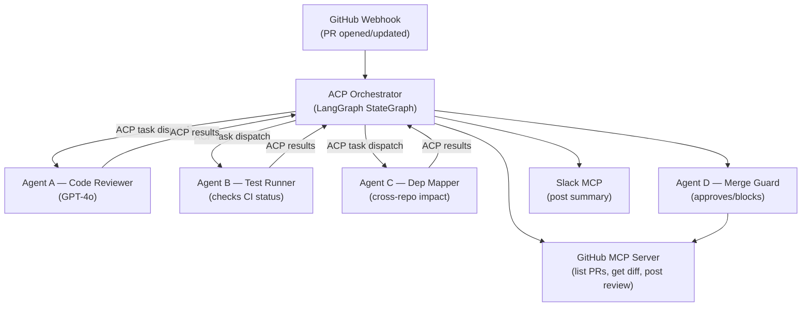
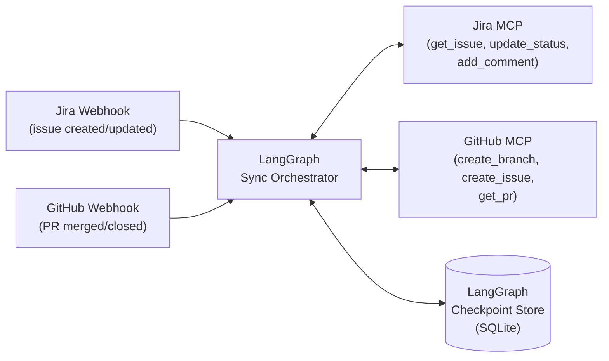
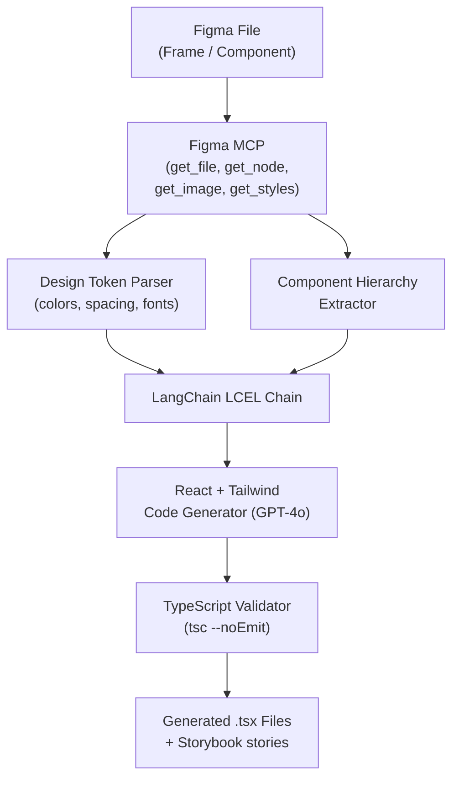
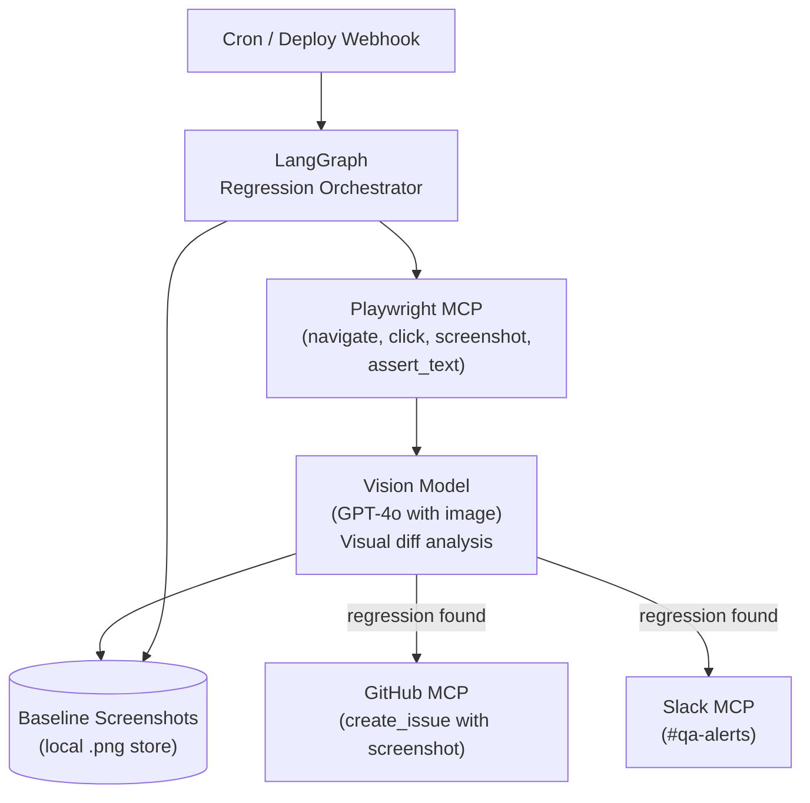
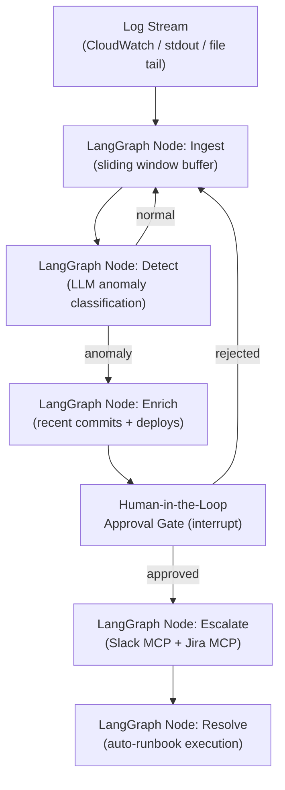
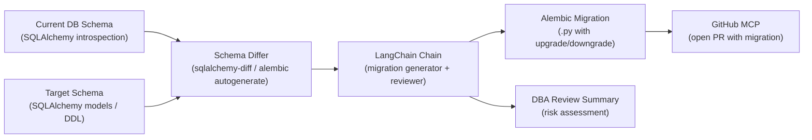
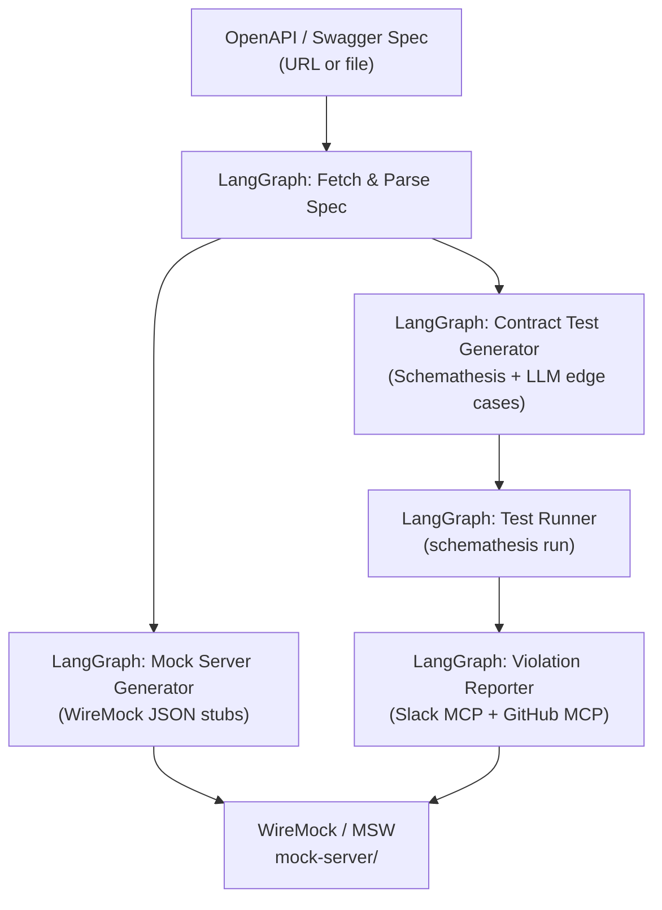
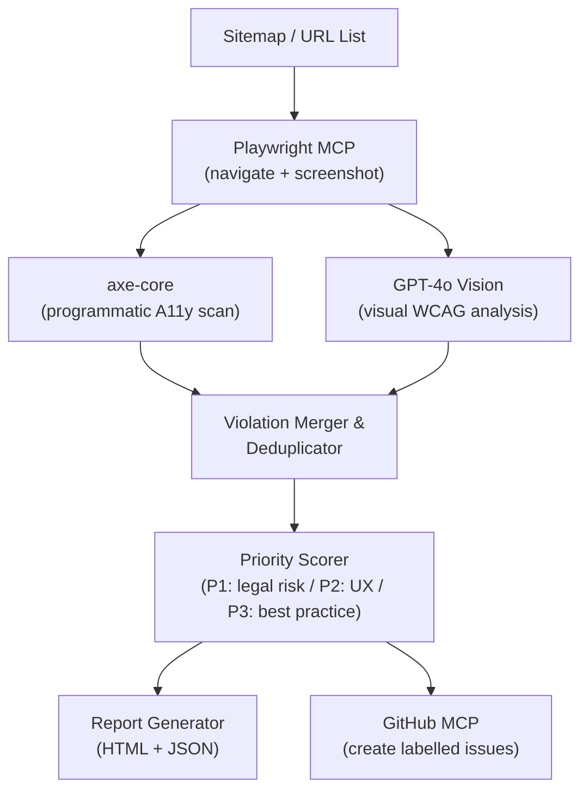

# Part 2 — New SDLC Automation Apps (Expanded)

> **Author:** Raviteja Thota | EngX AI Coach Program  
> **Purpose:** 8 new AI-powered app ideas (apps 2.13–2.20) extending the original AI-LIBRARIES-GUIDE.md  
> **Auth Pattern:** GitHub Copilot free tier via `gh auth token` → Azure Inference endpoint

```python
# Shared auth pattern used by every app in this guide
import subprocess
from openai import OpenAI

token = subprocess.run(["gh", "auth", "token"], capture_output=True, text=True).stdout.strip()
client = OpenAI(base_url="https://models.inference.ai.azure.com", api_key=token)
```

---

## Table of Contents

- [2.13 Multi-Repo PR Orchestrator (GitHub MCP + ACP)](#213-multi-repo-pr-orchestrator-github-mcp--acp)
- [2.14 Jira ↔ GitHub Sync Agent (Jira MCP + GitHub MCP + LangGraph)](#214-jira--github-sync-agent-jira-mcp--github-mcp--langgraph)
- [2.15 Figma-to-React Pipeline (Figma MCP + LangChain)](#215-figma-to-react-pipeline-figma-mcp--langchain)
- [2.16 Playwright Web Regression Agent (Playwright MCP + LangGraph)](#216-playwright-web-regression-agent-playwright-mcp--langgraph)
- [2.17 Real-Time Production Monitor (LangGraph + Slack MCP)](#217-real-time-production-monitor-langgraph--slack-mcp)
- [2.18 DB Schema Migration Assistant (LangChain + SQLAlchemy)](#218-db-schema-migration-assistant-langchain--sqlalchemy)
- [2.19 API Contract Tester & Mock Generator (LangGraph + Schemathesis)](#219-api-contract-tester--mock-generator-langgraph--schemathesis)
- [2.20 Accessibility Auditor (Vision Model + Playwright MCP)](#220-accessibility-auditor-vision-model--playwright-mcp)

---

## 2.13 Multi-Repo PR Orchestrator (GitHub MCP + ACP)

**One-liner:** An ACP-coordinated swarm of specialist agents that review, test, and merge PRs across multiple GitHub repositories in parallel.

### Problem Statement

Large platform teams manage 10–30 microservice repos simultaneously. A single PR in `auth-service` may depend on changes in `api-gateway` and `user-service`. Today, engineers manually track cross-repo dependencies, run checks separately, and coordinate merges by hand — losing 2–4 hours per release cycle.

### Architecture



### Tech Stack

| Component | Library / Tool | Cost |
|-----------|---------------|------|
| Agent framework | `langgraph` 0.2+ | Free |
| Multi-agent comms | `acp-sdk` (BeeAI) | Free |
| GitHub integration | `mcp-server-github` | Free |
| Slack notifications | `mcp-server-slack` | Free |
| LLM | GitHub Models (GPT-4o) | Free |
| Webhook server | `fastapi` + `uvicorn` | Free |

### Core Code Skeleton

```python
import subprocess, asyncio
from openai import OpenAI
from langgraph.graph import StateGraph, START, END
from typing import TypedDict, List

# --- Auth ---
token = subprocess.run(["gh", "auth", "token"], capture_output=True, text=True).stdout.strip()
client = OpenAI(base_url="https://models.inference.ai.azure.com", api_key=token)

# --- State ---
class PRState(TypedDict):
    repo: str
    pr_number: int
    diff: str
    review_comments: List[str]
    ci_status: str
    dep_impact: List[str]
    decision: str

# --- Nodes ---
def fetch_diff(state: PRState) -> dict:
    """Call GitHub MCP tool: get_pull_request_diff"""
    # MCP call returns unified diff as string
    diff = f"[diff for {state['repo']}#{state['pr_number']}]"
    return {"diff": diff}

def review_code(state: PRState) -> dict:
    resp = client.chat.completions.create(
        model="gpt-4o",
        messages=[
            {"role": "system", "content": "You are a senior code reviewer. Be concise."},
            {"role": "user", "content": f"Review this diff:\n{state['diff']}"},
        ],
    )
    return {"review_comments": [resp.choices[0].message.content]}

def check_ci(state: PRState) -> dict:
    """Call GitHub MCP: get_pull_request_checks"""
    return {"ci_status": "passed"}  # replace with real MCP call

def map_dependencies(state: PRState) -> dict:
    """Scan dependent repos for breaking changes."""
    return {"dep_impact": ["no breaking changes detected"]}

def merge_guard(state: PRState) -> dict:
    all_good = state["ci_status"] == "passed" and not any(
        "BLOCKER" in c for c in state["review_comments"]
    )
    return {"decision": "approve" if all_good else "request_changes"}

def route_decision(state: PRState) -> str:
    return "approve_pr" if state["decision"] == "approve" else "block_pr"

def approve_pr(state: PRState) -> dict:
    print(f"✅ Approving {state['repo']}#{state['pr_number']}")
    return state

def block_pr(state: PRState) -> dict:
    print(f"🚫 Blocking {state['repo']}#{state['pr_number']}: {state['review_comments']}")
    return state

# --- Graph ---
g = StateGraph(PRState)
for name, fn in [("fetch_diff", fetch_diff), ("review_code", review_code),
                 ("check_ci", check_ci), ("map_dependencies", map_dependencies),
                 ("merge_guard", merge_guard), ("approve_pr", approve_pr),
                 ("block_pr", block_pr)]:
    g.add_node(name, fn)

g.add_edge(START, "fetch_diff")
g.add_edge("fetch_diff", "review_code")
g.add_edge("fetch_diff", "check_ci")
g.add_edge("fetch_diff", "map_dependencies")
g.add_edge("review_code", "merge_guard")
g.add_edge("check_ci", "merge_guard")
g.add_edge("map_dependencies", "merge_guard")
g.add_conditional_edges("merge_guard", route_decision, {"approve_pr": "approve_pr", "block_pr": "block_pr"})
g.add_edge("approve_pr", END)
g.add_edge("block_pr", END)

app = g.compile()

if __name__ == "__main__":
    result = app.invoke({"repo": "my-org/auth-service", "pr_number": 42, "diff": "", "review_comments": [], "ci_status": "", "dep_impact": [], "decision": ""})
    print(result["decision"])
```

### Integration Points

- **GitHub Actions:** Trigger via `pull_request` webhook → POST to FastAPI endpoint
- **GitHub MCP:** `get_pull_request`, `create_pull_request_review`, `merge_pull_request`
- **Slack MCP:** `post_message` to `#pr-reviews` channel with decision summary
- **Jira MCP:** Link PR to ticket, transition story to "In Review"

### Free Resources

- [GitHub MCP Server](https://github.com/github/github-mcp-server)
- [BeeAI ACP SDK](https://github.com/i-am-bee/acp)
- [LangGraph multi-agent docs](https://langchain-ai.github.io/langgraph/tutorials/multi_agent/multi-agent-collaboration/)

---

## 2.14 Jira ↔ GitHub Sync Agent (Jira MCP + GitHub MCP + LangGraph)

**One-liner:** Keeps Jira tickets and GitHub issues/branches/PRs in perfect sync — automatically creates branches, updates ticket statuses, and links everything bidirectionally.

### Problem Statement

Teams waste 20–30 minutes per developer per day manually updating Jira ticket status, copy-pasting PR links into tickets, and creating branches with the right naming convention. Mismatches between Jira and GitHub create confusion during standups and sprint reviews.

### Architecture



### Tech Stack

| Component | Library / Tool | Cost |
|-----------|---------------|------|
| Orchestration | `langgraph` + `SqliteSaver` | Free |
| Jira integration | `mcp-atlassian` | Free |
| GitHub integration | `mcp-server-github` | Free |
| LLM (naming/summaries) | GitHub Models (gpt-4o-mini) | Free |
| Event server | `fastapi` | Free |

### Core Code Skeleton

```python
import subprocess, re
from openai import OpenAI
from langgraph.graph import StateGraph, START, END
from langgraph.checkpoint.sqlite import SqliteSaver
from typing import TypedDict, Optional

token = subprocess.run(["gh", "auth", "token"], capture_output=True, text=True).stdout.strip()
client = OpenAI(base_url="https://models.inference.ai.azure.com", api_key=token)

class SyncState(TypedDict):
    event_type: str          # "jira_created" | "pr_merged" | "pr_closed"
    jira_key: Optional[str]  # e.g. "PROJ-123"
    jira_summary: Optional[str]
    pr_number: Optional[int]
    branch_name: Optional[str]
    action_log: list

def generate_branch_name(state: SyncState) -> dict:
    if state["event_type"] != "jira_created":
        return {}
    resp = client.chat.completions.create(
        model="gpt-4o-mini",
        messages=[{"role": "user", "content":
            f"Generate a git branch name for Jira ticket {state['jira_key']}: "
            f"'{state['jira_summary']}'. Format: feature/PROJ-123-short-desc. "
            f"Return ONLY the branch name."}],
    )
    branch = resp.choices[0].message.content.strip()
    return {"branch_name": branch}

def create_github_branch(state: SyncState) -> dict:
    """Call GitHub MCP: create_branch"""
    if not state.get("branch_name"):
        return {}
    # MCP call: create_branch(repo="org/repo", branch=state["branch_name"], from_branch="main")
    log = f"Created branch: {state['branch_name']}"
    return {"action_log": state["action_log"] + [log]}

def update_jira_with_branch(state: SyncState) -> dict:
    """Call Jira MCP: add_comment with branch link"""
    if not state.get("branch_name"):
        return {}
    comment = f"Branch created: `{state['branch_name']}`\nGitHub: https://github.com/org/repo/tree/{state['branch_name']}"
    # MCP call: add_comment(issue_key=state["jira_key"], body=comment)
    return {"action_log": state["action_log"] + [f"Commented on {state['jira_key']}"]}

def transition_jira_on_merge(state: SyncState) -> dict:
    """On PR merge → move Jira ticket to Done"""
    if state["event_type"] not in ("pr_merged",):
        return {}
    # Extract Jira key from PR branch name or title via regex
    if state.get("branch_name"):
        match = re.search(r"([A-Z]+-\d+)", state["branch_name"] or "")
        jira_key = match.group(1) if match else state.get("jira_key")
    # MCP call: transition_issue(issue_key=jira_key, transition="Done")
    return {"action_log": state["action_log"] + [f"Transitioned {jira_key} → Done"]}

def route_event(state: SyncState) -> str:
    return "create_github_branch" if state["event_type"] == "jira_created" else "transition_jira_on_merge"

with SqliteSaver.from_conn_string("sync_checkpoints.db") as memory:
    g = StateGraph(SyncState)
    g.add_node("generate_branch_name", generate_branch_name)
    g.add_node("create_github_branch", create_github_branch)
    g.add_node("update_jira_with_branch", update_jira_with_branch)
    g.add_node("transition_jira_on_merge", transition_jira_on_merge)
    g.add_edge(START, "generate_branch_name")
    g.add_conditional_edges("generate_branch_name", route_event,
        {"create_github_branch": "create_github_branch",
         "transition_jira_on_merge": "transition_jira_on_merge"})
    g.add_edge("create_github_branch", "update_jira_with_branch")
    g.add_edge("update_jira_with_branch", END)
    g.add_edge("transition_jira_on_merge", END)
    app = g.compile(checkpointer=memory)
    result = app.invoke({"event_type": "jira_created", "jira_key": "PROJ-123",
        "jira_summary": "Add OAuth2 login flow", "pr_number": None,
        "branch_name": None, "action_log": []})
    print(result["action_log"])
```

### Integration Points

- **Jira MCP (`mcp-atlassian`):** `get_issue`, `add_comment`, `transition_issue`, `update_issue`
- **GitHub MCP:** `create_branch`, `get_pull_request`, `list_pull_requests`
- **Slack MCP:** Notify `#dev-updates` on every sync action
- **CI/CD:** GitHub Actions can call the FastAPI endpoint on `push` events

### Free Resources

- [mcp-atlassian](https://github.com/sooperset/mcp-atlassian)
- [LangGraph checkpointing](https://langchain-ai.github.io/langgraph/concepts/persistence/)
- [Jira REST API v3](https://developer.atlassian.com/cloud/jira/platform/rest/v3/)

---

## 2.15 Figma-to-React Pipeline (Figma MCP + LangChain)

**One-liner:** Converts Figma frames directly into production-ready React + Tailwind components by reading design tokens, extracting component hierarchy, and generating typed TypeScript code.

### Problem Statement

Frontend developers spend 60–80% of UI implementation time translating Figma designs into code — pixel-checking spacing, copying hex colors, and mapping component structures. A single screen can take 4–8 hours. Design-to-code tools like Anima produce messy, unmaintainable output.

### Architecture



### Tech Stack

| Component | Library / Tool | Cost |
|-----------|---------------|------|
| Design data | `figma-mcp` or `mcp-figma` | Free (Figma free plan) |
| LLM chain | `langchain` LCEL | Free |
| Code generation | GitHub Models (GPT-4o) | Free |
| Validation | Node.js + TypeScript | Free |
| Storybook gen | `@storybook/react` | Free |

### Core Code Skeleton

```python
import subprocess, json
from openai import OpenAI
from langchain_core.prompts import ChatPromptTemplate
from langchain_core.output_parsers import StrOutputParser

token = subprocess.run(["gh", "auth", "token"], capture_output=True, text=True).stdout.strip()
client = OpenAI(base_url="https://models.inference.ai.azure.com", api_key=token)

# Simulate Figma MCP response (replace with real MCP calls)
def fetch_figma_node(file_key: str, node_id: str) -> dict:
    """MCP tool: figma_get_node → returns component tree + styles"""
    return {
        "name": "LoginCard",
        "type": "FRAME",
        "styles": {"fill": "#FFFFFF", "cornerRadius": 8, "padding": 24},
        "children": [
            {"name": "Title", "type": "TEXT", "content": "Sign In", "style": {"fontSize": 24, "fontWeight": 700}},
            {"name": "EmailInput", "type": "INSTANCE", "component": "Input", "props": {"placeholder": "Email"}},
            {"name": "SubmitButton", "type": "INSTANCE", "component": "Button", "props": {"label": "Continue"}},
        ],
    }

def node_to_prompt(node: dict) -> str:
    return (
        f"Convert this Figma component spec into a React TypeScript component using Tailwind CSS.\n"
        f"Component name: {node['name']}\n"
        f"Spec (JSON):\n{json.dumps(node, indent=2)}\n\n"
        f"Requirements:\n"
        f"- Use functional components with TypeScript interfaces\n"
        f"- Map Figma styles to Tailwind classes (e.g. cornerRadius:8 → rounded-lg)\n"
        f"- Export the component as default\n"
        f"- Add a brief JSDoc comment\n"
        f"Return ONLY the .tsx file content."
    )

def generate_component(node: dict) -> str:
    prompt = node_to_prompt(node)
    resp = client.chat.completions.create(
        model="gpt-4o",
        messages=[
            {"role": "system", "content": "You are an expert React/TypeScript developer."},
            {"role": "user", "content": prompt},
        ],
        temperature=0.2,
    )
    return resp.choices[0].message.content

def generate_storybook_story(component_name: str, code: str) -> str:
    resp = client.chat.completions.create(
        model="gpt-4o-mini",
        messages=[{"role": "user", "content":
            f"Write a Storybook story for this React component:\n{code}\n"
            f"Use CSF3 format. Export default meta and one 'Default' story."}],
    )
    return resp.choices[0].message.content

if __name__ == "__main__":
    node = fetch_figma_node("abc123", "1:23")
    tsx_code = generate_component(node)
    story_code = generate_storybook_story(node["name"], tsx_code)

    comp_file = f"{node['name']}.tsx"
    story_file = f"{node['name']}.stories.tsx"

    with open(comp_file, "w") as f:
        f.write(tsx_code)
    with open(story_file, "w") as f:
        f.write(story_code)

    print(f"✅ Generated: {comp_file}, {story_file}")
```

### Integration Points

- **Figma MCP:** `get_file`, `get_node`, `get_image` (for screenshots), `get_styles` (design tokens)
- **GitHub MCP:** Auto-open PR with generated components
- **Storybook:** Auto-generated stories allow instant visual review
- **CI/CD:** Run `tsc --noEmit` in GitHub Actions to validate generated types

### Free Resources

- [Figma MCP Server](https://github.com/GLips/Figma-Context-MCP)
- [Figma REST API](https://www.figma.com/developers/api)
- [Tailwind CSS docs](https://tailwindcss.com/docs)

---

## 2.16 Playwright Web Regression Agent (Playwright MCP + LangGraph)

**One-liner:** An autonomous agent that uses Playwright MCP to navigate your web app, detect visual and functional regressions, and file GitHub issues with annotated screenshots.

### Problem Statement

QA engineers manually re-run regression scripts after every deployment. When something breaks at 2 AM, there's no one to catch it. Existing monitoring tools (Datadog Synthetics, Checkly) are expensive and require manual test authoring — they can't self-heal or intelligently describe what broke.

### Architecture



### Tech Stack

| Component | Library / Tool | Cost |
|-----------|---------------|------|
| Browser control | `@playwright/mcp` | Free |
| Orchestration | `langgraph` | Free |
| Visual analysis | GitHub Models (GPT-4o vision) | Free |
| Issue filing | `mcp-server-github` | Free |
| Alerting | `mcp-server-slack` | Free |
| Baseline store | Local filesystem (PNG) | Free |

### Core Code Skeleton

```python
import subprocess, base64, os
from openai import OpenAI
from langgraph.graph import StateGraph, START, END
from typing import TypedDict, List, Optional

token = subprocess.run(["gh", "auth", "token"], capture_output=True, text=True).stdout.strip()
client = OpenAI(base_url="https://models.inference.ai.azure.com", api_key=token)

BASELINE_DIR = "baselines"
os.makedirs(BASELINE_DIR, exist_ok=True)

class RegressionState(TypedDict):
    url: str
    page_name: str
    screenshot_path: Optional[str]
    baseline_path: Optional[str]
    regressions: List[str]
    issue_filed: bool

def capture_screenshot(state: RegressionState) -> dict:
    """Playwright MCP: navigate(url) → screenshot() → save PNG"""
    # MCP call: playwright_navigate(url=state["url"])
    # MCP call: playwright_screenshot() → base64 PNG
    screenshot_path = f"{state['page_name']}_current.png"
    # Simulated: write blank PNG for demo
    with open(screenshot_path, "wb") as f:
        f.write(b"\x89PNG\r\n\x1a\n")  # minimal PNG header
    return {"screenshot_path": screenshot_path}

def compare_with_baseline(state: RegressionState) -> dict:
    baseline_path = os.path.join(BASELINE_DIR, f"{state['page_name']}_baseline.png")
    if not os.path.exists(baseline_path):
        # First run: save as baseline
        import shutil
        shutil.copy(state["screenshot_path"], baseline_path)
        return {"baseline_path": baseline_path, "regressions": ["First run: baseline saved"]}

    def encode(path):
        with open(path, "rb") as f:
            return base64.b64encode(f.read()).decode()

    resp = client.chat.completions.create(
        model="gpt-4o",
        messages=[{
            "role": "user",
            "content": [
                {"type": "text", "text": (
                    f"Compare these two screenshots of '{state['page_name']}'.\n"
                    "List any visual regressions (layout shifts, missing elements, broken styles).\n"
                    "Reply with a JSON list: [{\"element\": \"...\", \"issue\": \"...\"}]. "
                    "Return [] if no regressions.")},
                {"type": "image_url", "image_url": {"url": f"data:image/png;base64,{encode(baseline_path)}"}},
                {"type": "image_url", "image_url": {"url": f"data:image/png;base64,{encode(state['screenshot_path'])}"}},
            ],
        }],
    )
    import json
    regressions = json.loads(resp.choices[0].message.content)
    return {"baseline_path": baseline_path, "regressions": [r["issue"] for r in regressions]}

def file_github_issue(state: RegressionState) -> dict:
    if not state["regressions"] or state["regressions"] == ["First run: baseline saved"]:
        return {"issue_filed": False}
    body = "\n".join(f"- {r}" for r in state["regressions"])
    # GitHub MCP: create_issue(title=f"Visual regression on {state['page_name']}",
    #                          body=f"## Regressions\n{body}", labels=["regression", "automated"])
    print(f"🐛 Filed GitHub issue for {state['page_name']}: {len(state['regressions'])} regressions")
    return {"issue_filed": True}

g = StateGraph(RegressionState)
for name, fn in [("capture_screenshot", capture_screenshot),
                 ("compare_with_baseline", compare_with_baseline),
                 ("file_github_issue", file_github_issue)]:
    g.add_node(name, fn)

g.add_edge(START, "capture_screenshot")
g.add_edge("capture_screenshot", "compare_with_baseline")
g.add_edge("compare_with_baseline", "file_github_issue")
g.add_edge("file_github_issue", END)
app = g.compile()

if __name__ == "__main__":
    pages = [
        {"url": "http://localhost:3000/login", "page_name": "login"},
        {"url": "http://localhost:3000/dashboard", "page_name": "dashboard"},
    ]
    for page in pages:
        result = app.invoke({**page, "screenshot_path": None, "baseline_path": None,
                             "regressions": [], "issue_filed": False})
        status = "🔴 REGRESSION" if result["issue_filed"] else "✅ OK"
        print(f"{status}: {page['page_name']}")
```

### Integration Points

- **Playwright MCP:** `playwright_navigate`, `playwright_screenshot`, `playwright_click`, `playwright_fill`
- **GitHub MCP:** `create_issue` with screenshot attachment and `regression` label
- **Slack MCP:** `post_message` to `#qa-alerts` with screenshot URL
- **GitHub Actions:** Schedule with `cron: '0 * * * *'` for hourly regression checks

### Free Resources

- [Playwright MCP](https://github.com/microsoft/playwright-mcp)
- [GPT-4o Vision API](https://platform.openai.com/docs/guides/vision)
- [LangGraph cron patterns](https://langchain-ai.github.io/langgraph/tutorials/)

---

## 2.17 Real-Time Production Monitor (LangGraph + Slack MCP)

**One-liner:** A persistent LangGraph daemon that ingests live log streams, detects anomalies using LLM-powered pattern matching, escalates via Slack MCP, and auto-creates Jira incidents — with human-in-the-loop approval gates.

### Problem Statement

On-call engineers are woken up by noisy, unhelpful PagerDuty alerts that say "CPU spike" with no context. They spend 15–30 minutes manually correlating logs, checking dashboards, and forming a hypothesis before writing the incident ticket. An intelligent monitor can pre-digest the context and deliver a ready-to-act summary.

### Architecture



### Tech Stack

| Component | Library / Tool | Cost |
|-----------|---------------|------|
| State machine | `langgraph` with streaming | Free |
| Human-in-loop | `langgraph` interrupt/resume | Free |
| Alerting | `mcp-server-slack` | Free |
| Incident tickets | `mcp-atlassian` (Jira) | Free |
| LLM | GitHub Models (GPT-4o) | Free |
| Log source | Python `watchdog` / `tail -f` | Free |

### Core Code Skeleton

```python
import subprocess, time, collections
from openai import OpenAI
from langgraph.graph import StateGraph, START, END
from langgraph.checkpoint.sqlite import SqliteSaver
from langgraph.types import interrupt
from typing import TypedDict, List, Optional, Deque

token = subprocess.run(["gh", "auth", "token"], capture_output=True, text=True).stdout.strip()
client = OpenAI(base_url="https://models.inference.ai.azure.com", api_key=token)

LOG_WINDOW = 50  # lines

class MonitorState(TypedDict):
    log_buffer: List[str]
    anomaly_detected: bool
    anomaly_summary: str
    recent_deploys: List[str]
    human_approved: Optional[bool]
    incident_id: Optional[str]

def ingest_logs(state: MonitorState) -> dict:
    """In production: tail log file or poll CloudWatch. Here: simulate."""
    new_lines = [
        "2025-01-15 03:42:11 ERROR NullPointerException at PaymentService.java:142",
        "2025-01-15 03:42:12 ERROR NullPointerException at PaymentService.java:142",
        "2025-01-15 03:42:13 WARN  DB connection pool exhausted (pool_size=10)",
    ]
    buffer = (state["log_buffer"] + new_lines)[-LOG_WINDOW:]
    return {"log_buffer": buffer}

def detect_anomaly(state: MonitorState) -> dict:
    logs_text = "\n".join(state["log_buffer"])
    resp = client.chat.completions.create(
        model="gpt-4o",
        messages=[{"role": "user", "content":
            f"Analyze these production logs for anomalies:\n{logs_text}\n\n"
            "Respond with JSON: {{\"anomaly\": true/false, \"summary\": \"...\", \"severity\": \"P1/P2/P3\"}}"}],
        response_format={"type": "json_object"},
    )
    import json
    data = json.loads(resp.choices[0].message.content)
    return {"anomaly_detected": data["anomaly"], "anomaly_summary": data.get("summary", "")}

def enrich_context(state: MonitorState) -> dict:
    """GitHub MCP: list recent commits/deploys for context"""
    recent = ["deploy/v2.3.1 by alice (15 min ago)", "fix: payment null check (2 hr ago)"]
    return {"recent_deploys": recent}

def human_approval_gate(state: MonitorState) -> dict:
    """LangGraph interrupt: pause and ask on-call engineer via Slack"""
    summary = state["anomaly_summary"]
    deploys = "\n".join(state["recent_deploys"])
    # Slack MCP: post_message with approve/reject buttons
    print(f"⚠️  ANOMALY: {summary}\nRecent deploys:\n{deploys}")
    approved = interrupt({"message": "Approve incident creation?", "anomaly": summary})
    return {"human_approved": approved}

def escalate_incident(state: MonitorState) -> dict:
    if not state.get("human_approved"):
        return {"incident_id": None}
    # Jira MCP: create_issue(project="OPS", type="Incident", summary=state["anomaly_summary"])
    incident_id = "OPS-9999"  # replace with real MCP call
    # Slack MCP: post_message("#incidents", f"Incident {incident_id} created: {state['anomaly_summary']}")
    print(f"🚨 Incident {incident_id} created and posted to #incidents")
    return {"incident_id": incident_id}

def route_anomaly(state: MonitorState) -> str:
    return "enrich_context" if state["anomaly_detected"] else "ingest_logs"

with SqliteSaver.from_conn_string("monitor_checkpoints.db") as memory:
    g = StateGraph(MonitorState)
    for name, fn in [("ingest_logs", ingest_logs), ("detect_anomaly", detect_anomaly),
                     ("enrich_context", enrich_context), ("human_approval_gate", human_approval_gate),
                     ("escalate_incident", escalate_incident)]:
        g.add_node(name, fn)
    g.add_edge(START, "ingest_logs")
    g.add_edge("ingest_logs", "detect_anomaly")
    g.add_conditional_edges("detect_anomaly", route_anomaly,
        {"enrich_context": "enrich_context", "ingest_logs": "ingest_logs"})
    g.add_edge("enrich_context", "human_approval_gate")
    g.add_edge("human_approval_gate", "escalate_incident")
    g.add_edge("escalate_incident", END)
    app = g.compile(checkpointer=memory, interrupt_before=["human_approval_gate"])
    config = {"configurable": {"thread_id": "monitor-prod-1"}}
    result = app.invoke({"log_buffer": [], "anomaly_detected": False, "anomaly_summary": "",
        "recent_deploys": [], "human_approved": None, "incident_id": None}, config)
    print(result)
```

### Integration Points

- **Slack MCP:** Interactive message with Approve/Reject buttons (Block Kit)
- **Jira MCP:** `create_issue` in `OPS` project with severity label
- **GitHub MCP:** `list_commits` to correlate anomalies with recent deployments
- **PagerDuty:** Webhook integration to auto-escalate P1 incidents

### Free Resources

- [LangGraph human-in-the-loop](https://langchain-ai.github.io/langgraph/tutorials/customer-support/customer-support/)
- [LangGraph streaming](https://langchain-ai.github.io/langgraph/how-tos/stream-values/)
- [Slack Block Kit Builder](https://app.slack.com/block-kit-builder)

---

## 2.18 DB Schema Migration Assistant (LangChain + SQLAlchemy)

**One-liner:** Analyses existing database schemas, generates Alembic migration scripts with rollback support, detects breaking changes, and produces human-readable change summaries for DBA review.

### Problem Statement

Writing Alembic migrations is error-prone and tedious — engineers must manually diff schemas, handle foreign key ordering, generate both `upgrade()` and `downgrade()` functions, and document what changed. A single missed `nullable=False` on an existing column causes a production outage.

### Architecture



### Tech Stack

| Component | Library / Tool | Cost |
|-----------|---------------|------|
| Schema introspection | `sqlalchemy` + `alembic` | Free |
| Migration generation | `langchain` LCEL | Free |
| LLM | GitHub Models (GPT-4o) | Free |
| Risk analysis | `langchain` structured output | Free |
| PR creation | `mcp-server-github` | Free |
| DB support | PostgreSQL / MySQL / SQLite | Free |

### Core Code Skeleton

```python
import subprocess
from openai import OpenAI
from langchain_core.prompts import ChatPromptTemplate
from langchain_core.output_parsers import StrOutputParser
from datetime import datetime

token = subprocess.run(["gh", "auth", "token"], capture_output=True, text=True).stdout.strip()
client = OpenAI(base_url="https://models.inference.ai.azure.com", api_key=token)

def get_schema_diff(current_ddl: str, target_ddl: str) -> str:
    """In production: use alembic autogenerate or sqlalchemy-diff."""
    return f"--- current\n{current_ddl}\n+++ target\n{target_ddl}"

def generate_migration(diff: str, revision_id: str) -> str:
    prompt = (
        f"Generate an Alembic migration script for this schema diff:\n\n{diff}\n\n"
        "Requirements:\n"
        "1. Include both upgrade() and downgrade() functions\n"
        "2. Handle FK constraints with proper op.drop_constraint before alter\n"
        "3. Add inline comments for non-obvious changes\n"
        "4. Revision ID: {revision_id}\n"
        "Return ONLY valid Python code for the migration file."
    ).format(revision_id=revision_id)

    resp = client.chat.completions.create(
        model="gpt-4o",
        messages=[
            {"role": "system", "content": "You are an expert SQLAlchemy/Alembic migration engineer."},
            {"role": "user", "content": prompt},
        ],
        temperature=0.1,
    )
    return resp.choices[0].message.content

def assess_migration_risk(migration_code: str) -> dict:
    resp = client.chat.completions.create(
        model="gpt-4o",
        messages=[{"role": "user", "content":
            f"Analyse this Alembic migration for risks:\n{migration_code}\n\n"
            "Return JSON with keys: risk_level (low/medium/high), "
            "breaking_changes (list), recommended_window (string), "
            "requires_downtime (bool), notes (string)"}],
        response_format={"type": "json_object"},
    )
    import json
    return json.loads(resp.choices[0].message.content)

def save_migration(code: str, revision_id: str) -> str:
    ts = datetime.now().strftime("%Y%m%d_%H%M%S")
    filename = f"migrations/versions/{ts}_{revision_id}.py"
    import os
    os.makedirs("migrations/versions", exist_ok=True)
    with open(filename, "w") as f:
        f.write(code)
    return filename

if __name__ == "__main__":
    current_ddl = "CREATE TABLE users (id SERIAL PRIMARY KEY, email VARCHAR(255));"
    target_ddl = (
        "CREATE TABLE users (id SERIAL PRIMARY KEY, email VARCHAR(255) UNIQUE NOT NULL, "
        "created_at TIMESTAMP DEFAULT NOW(), role VARCHAR(50) DEFAULT 'user');"
    )

    diff = get_schema_diff(current_ddl, target_ddl)
    revision_id = "add_users_unique_email_role"
    migration_code = generate_migration(diff, revision_id)
    risk = assess_migration_risk(migration_code)
    filename = save_migration(migration_code, revision_id)

    print(f"✅ Migration saved: {filename}")
    print(f"⚠️  Risk Level: {risk['risk_level'].upper()}")
    print(f"🕐 Recommended window: {risk['recommended_window']}")
    if risk.get("breaking_changes"):
        print("Breaking changes:")
        for change in risk["breaking_changes"]:
            print(f"  - {change}")
    # GitHub MCP: create_pull_request with migration file
    print(f"\nNext: open PR with {filename} for DBA review")
```

### Integration Points

- **Alembic:** `alembic autogenerate` for baseline diff detection
- **GitHub MCP:** Auto-open PRs with migration files; add DBA as required reviewer
- **Jira MCP:** Create "DB Change" ticket linked to the PR
- **Slack MCP:** Notify `#database-changes` with risk summary and PR link
- **CI/CD:** `alembic upgrade head --sql` dry-run in GitHub Actions

### Free Resources

- [Alembic docs](https://alembic.sqlalchemy.org/en/latest/)
- [sqlalchemy-diff](https://github.com/sidorov-panda/sqlalchemy-diff)
- [LangChain structured output](https://python.langchain.com/docs/how_to/structured_output/)

---

## 2.19 API Contract Tester & Mock Generator (LangGraph + Schemathesis)

**One-liner:** Reads OpenAPI specs, generates property-based contract tests using Schemathesis, auto-creates Wiremock/MSW mock servers, and reports contract violations back to the API team via Slack.

### Problem Statement

Consumer-driven contract testing (Pact) requires coordination between teams. Most teams skip it entirely. The result: frontend breaks after backend deploys, integration tests catch bugs too late, and mock servers drift from reality. An AI agent can own the entire contract lifecycle automatically.

### Architecture



### Tech Stack

| Component | Library / Tool | Cost |
|-----------|---------------|------|
| Spec parsing | `pyyaml` + `jsonschema` | Free |
| Contract testing | `schemathesis` | Free |
| Mock generation | `wiremock` (Docker) or `msw` | Free |
| Orchestration | `langgraph` | Free |
| LLM (edge cases) | GitHub Models (GPT-4o) | Free |
| Reporting | `mcp-server-slack` + `mcp-server-github` | Free |

### Core Code Skeleton

```python
import subprocess, json, yaml, os
from openai import OpenAI
from langgraph.graph import StateGraph, START, END
from typing import TypedDict, List, Dict, Any

token = subprocess.run(["gh", "auth", "token"], capture_output=True, text=True).stdout.strip()
client = OpenAI(base_url="https://models.inference.ai.azure.com", api_key=token)

class ContractState(TypedDict):
    spec_path: str
    spec: Dict[str, Any]
    endpoints: List[Dict]
    edge_cases: List[Dict]
    mock_stubs: List[Dict]
    violations: List[str]
    report_url: str

def parse_spec(state: ContractState) -> dict:
    with open(state["spec_path"]) as f:
        spec = yaml.safe_load(f) if state["spec_path"].endswith(".yaml") else json.load(f)
    endpoints = []
    for path, methods in spec.get("paths", {}).items():
        for method, details in methods.items():
            if method in ("get", "post", "put", "delete", "patch"):
                endpoints.append({"path": path, "method": method.upper(),
                                   "summary": details.get("summary", ""), "details": details})
    return {"spec": spec, "endpoints": endpoints}

def generate_edge_cases(state: ContractState) -> dict:
    endpoints_summary = json.dumps([{"path": e["path"], "method": e["method"],
                                      "summary": e["summary"]} for e in state["endpoints"]], indent=2)
    resp = client.chat.completions.create(
        model="gpt-4o",
        messages=[{"role": "user", "content":
            f"For these API endpoints:\n{endpoints_summary}\n\n"
            "Generate edge case test scenarios as JSON list with keys: "
            "endpoint, method, case_name, input_data, expected_status_code, description.\n"
            "Focus on: empty bodies, max-length strings, negative numbers, missing required fields, "
            "SQL injection strings, Unicode edge cases."}],
        response_format={"type": "json_object"},
    )
    data = json.loads(resp.choices[0].message.content)
    cases = data.get("cases", data) if isinstance(data, dict) else data
    return {"edge_cases": cases if isinstance(cases, list) else []}

def generate_mock_stubs(state: ContractState) -> dict:
    stubs = []
    for endpoint in state["endpoints"][:5]:  # limit for demo
        stub = {
            "request": {"method": endpoint["method"], "url": endpoint["path"]},
            "response": {
                "status": 200,
                "headers": {"Content-Type": "application/json"},
                "jsonBody": {"message": "mock response", "data": {}},
            },
        }
        stubs.append(stub)
    # Save WireMock stubs
    os.makedirs("mock-server/mappings", exist_ok=True)
    for i, stub in enumerate(stubs):
        with open(f"mock-server/mappings/stub_{i}.json", "w") as f:
            json.dump(stub, f, indent=2)
    return {"mock_stubs": stubs}

def run_contract_tests(state: ContractState) -> dict:
    """Run schemathesis against a live or mock server"""
    # In production: subprocess.run(["schemathesis", "run", state["spec_path"],
    #                                "--base-url", "http://localhost:8080", "--checks", "all"])
    violations = []
    for case in state.get("edge_cases", []):
        if case.get("expected_status_code") == 400:
            # Simulate: some endpoints return 500 instead of 400
            violations.append(f"{case['method']} {case['endpoint']}: returned 500, expected 400 for '{case['case_name']}'")
    return {"violations": violations}

def report_results(state: ContractState) -> dict:
    if state["violations"]:
        report = "\n".join(f"• {v}" for v in state["violations"])
        # Slack MCP: post_message("#api-contracts", f"🚨 {len(state['violations'])} contract violations:\n{report}")
        # GitHub MCP: create_issue(title="API Contract Violations", body=report, labels=["contract", "bug"])
        print(f"🚨 {len(state['violations'])} violations reported")
    else:
        print("✅ All contract tests passed")
    print(f"📁 Mock stubs saved to mock-server/mappings/ ({len(state['mock_stubs'])} stubs)")
    return {"report_url": "https://github.com/org/repo/issues/new"}

g = StateGraph(ContractState)
for name, fn in [("parse_spec", parse_spec), ("generate_edge_cases", generate_edge_cases),
                 ("generate_mock_stubs", generate_mock_stubs), ("run_contract_tests", run_contract_tests),
                 ("report_results", report_results)]:
    g.add_node(name, fn)
g.add_edge(START, "parse_spec")
g.add_edge("parse_spec", "generate_edge_cases")
g.add_edge("parse_spec", "generate_mock_stubs")
g.add_edge("generate_edge_cases", "run_contract_tests")
g.add_edge("generate_mock_stubs", "run_contract_tests")
g.add_edge("run_contract_tests", "report_results")
g.add_edge("report_results", END)
app = g.compile()

if __name__ == "__main__":
    # Create a minimal OpenAPI spec for demo
    sample_spec = {"openapi": "3.0.0", "info": {"title": "Demo", "version": "1.0"},
                   "paths": {"/users": {"get": {"summary": "List users", "responses": {"200": {"description": "OK"}}}},
                             "/users/{id}": {"delete": {"summary": "Delete user", "responses": {"204": {"description": "No Content"}}}}}}
    with open("demo_spec.yaml", "w") as f:
        yaml.dump(sample_spec, f)
    result = app.invoke({"spec_path": "demo_spec.yaml", "spec": {}, "endpoints": [],
                         "edge_cases": [], "mock_stubs": [], "violations": [], "report_url": ""})
```

### Integration Points

- **Schemathesis CLI:** `schemathesis run openapi.yaml --base-url http://api-server --checks all`
- **WireMock Docker:** `docker run -p 8080:8080 -v $(pwd)/mock-server:/home/wiremock wiremock/wiremock`
- **GitHub MCP:** Create issues for violations; link to API version tag
- **Slack MCP:** Weekly contract health digest to `#engineering`
- **CI/CD:** Run as part of `integration-tests` GitHub Actions job

### Free Resources

- [Schemathesis docs](https://schemathesis.readthedocs.io/)
- [WireMock docs](https://wiremock.org/docs/)
- [MSW (Mock Service Worker)](https://mswjs.io/)
- [OpenAPI Specification](https://swagger.io/specification/)

---

## 2.20 Accessibility Auditor (Vision Model + Playwright MCP)

**One-liner:** Screenshots every page of your web app, uses GPT-4o vision to identify WCAG 2.1 accessibility violations, generates a prioritised fix report, and creates GitHub issues with annotated screenshots.

### Problem Statement

Accessibility audits are typically done manually by specialists, cost thousands of dollars, and happen once a year — meaning violations accumulate in every sprint. Automated tools like axe-core only catch ~30% of WCAG issues (it misses contrast issues in images, missing alt-text meaning, keyboard trap detection). An LLM with vision can catch the other 70%.

### Architecture



### Tech Stack

| Component | Library / Tool | Cost |
|-----------|---------------|------|
| Browser automation | `@playwright/mcp` | Free |
| A11y scanning | `axe-playwright` (Python: `axe-core-python`) | Free |
| Vision analysis | GitHub Models (GPT-4o) | Free |
| Orchestration | `langgraph` | Free |
| Issue filing | `mcp-server-github` | Free |
| Report format | `jinja2` HTML template | Free |

### Core Code Skeleton

```python
import subprocess, base64, json, os
from openai import OpenAI
from langgraph.graph import StateGraph, START, END
from typing import TypedDict, List, Optional

token = subprocess.run(["gh", "auth", "token"], capture_output=True, text=True).stdout.strip()
client = OpenAI(base_url="https://models.inference.ai.azure.com", api_key=token)

WCAG_SYSTEM = """You are a WCAG 2.1 AA accessibility expert.
Analyse the screenshot and identify violations. For each violation return JSON:
{"violations": [{"wcag_criterion": "1.4.3", "severity": "critical|serious|moderate|minor",
 "element_description": "...", "issue": "...", "fix_suggestion": "...", "legal_risk": true/false}]}
Focus on: color contrast, missing alt text, keyboard focus indicators, form labels,
heading hierarchy, error identification, and time-based media."""

class A11yState(TypedDict):
    url: str
    page_name: str
    screenshot_b64: Optional[str]
    axe_violations: List[dict]
    vision_violations: List[dict]
    all_violations: List[dict]
    issues_created: List[str]

def capture_and_axe_scan(state: A11yState) -> dict:
    """Playwright MCP: navigate + screenshot + inject axe-core"""
    # MCP calls:
    # playwright_navigate(url=state["url"])
    # screenshot = playwright_screenshot()  → base64
    # axe_results = playwright_evaluate("axe.run()")  → JSON violations
    screenshot_b64 = ""  # replace with real MCP call
    axe_violations = [  # simulated axe results
        {"id": "color-contrast", "impact": "serious",
         "description": "Ensure text has sufficient contrast", "nodes": [{"html": "<button class='submit'>"}]},
    ]
    return {"screenshot_b64": screenshot_b64, "axe_violations": axe_violations}

def vision_audit(state: A11yState) -> dict:
    if not state.get("screenshot_b64"):
        # Use a placeholder for demo when no real screenshot
        print(f"  ⚠️  No screenshot for {state['page_name']}, skipping vision audit")
        return {"vision_violations": []}

    resp = client.chat.completions.create(
        model="gpt-4o",
        messages=[{
            "role": "user",
            "content": [
                {"type": "text", "text": f"Page: {state['url']}\n{WCAG_SYSTEM}"},
                {"type": "image_url",
                 "image_url": {"url": f"data:image/png;base64,{state['screenshot_b64']}"}},
            ],
        }],
        response_format={"type": "json_object"},
    )
    data = json.loads(resp.choices[0].message.content)
    return {"vision_violations": data.get("violations", [])}

def merge_violations(state: A11yState) -> dict:
    """Merge axe + vision violations, deduplicate by WCAG criterion."""
    seen = set()
    merged = []
    for v in state["axe_violations"]:
        key = f"axe-{v.get('id', '')}"
        if key not in seen:
            seen.add(key)
            merged.append({"source": "axe", "severity": v.get("impact", "unknown"),
                           "issue": v.get("description", ""), "element": str(v.get("nodes", [{}])[0])})
    for v in state["vision_violations"]:
        key = f"vision-{v.get('wcag_criterion', '')}-{v.get('issue', '')[:30]}"
        if key not in seen:
            seen.add(key)
            merged.append({"source": "vision", "wcag": v.get("wcag_criterion", ""),
                           "severity": v.get("severity", "unknown"), "issue": v.get("issue", ""),
                           "fix": v.get("fix_suggestion", ""), "legal_risk": v.get("legal_risk", False)})
    merged.sort(key=lambda x: {"critical": 0, "serious": 1, "moderate": 2, "minor": 3}.get(x.get("severity", "minor"), 3))
    return {"all_violations": merged}

def create_github_issues(state: A11yState) -> dict:
    critical = [v for v in state["all_violations"] if v.get("severity") in ("critical", "serious")]
    created = []
    for v in critical[:5]:  # cap at 5 issues per page
        title = f"A11y [{v.get('wcag', v.get('source','?'))}]: {v['issue'][:60]}"
        body = (f"**Page:** {state['url']}\n**Severity:** {v['severity']}\n"
                f"**Issue:** {v['issue']}\n**Fix:** {v.get('fix', 'See WCAG docs')}\n"
                f"**Legal Risk:** {'⚠️ Yes' if v.get('legal_risk') else 'No'}")
        # GitHub MCP: create_issue(title=title, body=body, labels=["accessibility", v["severity"]])
        created.append(title)
        print(f"  🐛 Issue: {title}")
    return {"issues_created": created}

g = StateGraph(A11yState)
for name, fn in [("capture_and_axe_scan", capture_and_axe_scan), ("vision_audit", vision_audit),
                 ("merge_violations", merge_violations), ("create_github_issues", create_github_issues)]:
    g.add_node(name, fn)
g.add_edge(START, "capture_and_axe_scan")
g.add_edge("capture_and_axe_scan", "vision_audit")
g.add_edge("vision_audit", "merge_violations")
g.add_edge("merge_violations", "create_github_issues")
g.add_edge("create_github_issues", END)
app = g.compile()

if __name__ == "__main__":
    pages = [
        {"url": "http://localhost:3000/", "page_name": "home"},
        {"url": "http://localhost:3000/login", "page_name": "login"},
        {"url": "http://localhost:3000/checkout", "page_name": "checkout"},
    ]
    all_results = []
    for page in pages:
        print(f"\n🔍 Auditing: {page['url']}")
        result = app.invoke({**page, "screenshot_b64": None, "axe_violations": [],
                             "vision_violations": [], "all_violations": [], "issues_created": []})
        total = len(result["all_violations"])
        critical = sum(1 for v in result["all_violations"] if v.get("severity") in ("critical", "serious"))
        print(f"  Found {total} violations ({critical} critical/serious), {len(result['issues_created'])} issues created")
        all_results.append(result)

    total_issues = sum(len(r["issues_created"]) for r in all_results)
    print(f"\n📊 Audit complete: {total_issues} GitHub issues created across {len(pages)} pages")
```

### Integration Points

- **Playwright MCP:** `playwright_navigate`, `playwright_screenshot`, `playwright_evaluate` (inject axe-core)
- **GitHub MCP:** Create labelled issues with `accessibility` + severity tags; assign to front-end team
- **Slack MCP:** Weekly accessibility score digest to `#frontend` channel
- **CI/CD:** Run on every PR that touches CSS/HTML files (GitHub Actions path filter)
- **Jira MCP:** Create accessibility backlog items with WCAG criterion as label

### Free Resources

- [axe-core](https://github.com/dequelabs/axe-core) — open source accessibility engine
- [WCAG 2.1 Quick Reference](https://www.w3.org/WAI/WCAG21/quickref/)
- [Playwright MCP](https://github.com/microsoft/playwright-mcp)
- [WebAIM Contrast Checker](https://webaim.org/resources/contrastchecker/) — validate generated fixes

---

## Summary Table

| # | App Name | Key Protocol | Primary LLM Use | SDLC Phase |
|---|----------|-------------|-----------------|------------|
| 2.13 | Multi-Repo PR Orchestrator | ACP + GitHub MCP | Code review | Code Review |
| 2.14 | Jira ↔ GitHub Sync Agent | Jira MCP + GitHub MCP | Branch naming, summaries | Planning → Dev |
| 2.15 | Figma-to-React Pipeline | Figma MCP | Component code gen | Design → Dev |
| 2.16 | Playwright Web Regression Agent | Playwright MCP | Visual diff analysis | QA |
| 2.17 | Real-Time Production Monitor | Slack MCP + LangGraph | Anomaly detection | Operations |
| 2.18 | DB Schema Migration Assistant | SQLAlchemy + GitHub MCP | Migration script gen | Dev → Deploy |
| 2.19 | API Contract Tester & Mock Generator | Schemathesis + GitHub MCP | Edge case generation | QA |
| 2.20 | Accessibility Auditor | Playwright MCP + Vision | WCAG violation detection | QA → Release |

---

## Shared Patterns Across All 8 Apps

### 1. Free Auth (used everywhere)
```python
import subprocess
from openai import OpenAI
token = subprocess.run(["gh", "auth", "token"], capture_output=True, text=True).stdout.strip()
client = OpenAI(base_url="https://models.inference.ai.azure.com", api_key=token)
```

### 2. ACP Multi-Agent Dispatch Pattern
```python
from acp_sdk.client import Client as ACPClient

async def dispatch_to_agent(agent_url: str, task: dict) -> dict:
    async with ACPClient(base_url=agent_url) as acp:
        run = await acp.runs.create(agent_name="specialist", input=[{"role": "user", "content": str(task)}])
        async for event in acp.runs.stream(run.run_id):
            if event.type == "run.completed":
                return event.run.output
```

### 3. MCP Tool Call Pattern (any MCP server)
```python
from mcp import ClientSession, StdioServerParameters
from mcp.client.stdio import stdio_client

async def call_mcp_tool(server_cmd: list, tool_name: str, args: dict):
    async with stdio_client(StdioServerParameters(command=server_cmd[0], args=server_cmd[1:])) as (r, w):
        async with ClientSession(r, w) as session:
            await session.initialize()
            return await session.call_tool(tool_name, args)
```

### 4. LangGraph Human-in-the-Loop Gate
```python
from langgraph.types import interrupt

def approval_gate(state: dict) -> dict:
    decision = interrupt({"summary": state["summary"], "action": state["proposed_action"]})
    return {"approved": decision}
# Resume after human responds:
# app.invoke(None, config, command=Command(resume=True))
```

---

*End of Part 2 — Expanded (Apps 2.13–2.20)*
