# 🤖 Ultimate AI-Powered PR Documentation Generator

## 🎯 Vision
A high-performance, universal, AI-driven documentation system that generates **comprehensive technical documentation with architectural diagrams** for developers and code reviewers across any programming language or framework.

---

## ⚡ Core Capabilities

### 1. **Universal Language Support**
- ✅ Java, Python, JavaScript/TypeScript, C#, Go, Rust, Kotlin, Swift
- ✅ Any JVM language (Scala, Groovy, Clojure)
- ✅ Any .NET language (F#, VB.NET)
- ✅ Shell scripts (Bash, PowerShell, Zsh)
- ✅ SQL, YAML, JSON, XML configuration files
- ✅ Infrastructure as Code (Terraform, CloudFormation, Ansible)

### 2. **Automatic Diagram Generation**
- 🎨 **Mermaid Diagrams** - Class, Sequence, Flow, State, ER diagrams
- 🎨 **PlantUML** - Architecture, Component, Deployment diagrams
- 🎨 **Python Diagrams** - Cloud architecture (AWS, Azure, GCP)
- 🎨 **Graphviz** - Complex relationship graphs
- 🎨 **Draw.io XML** - Editable visual diagrams

### 3. **LLD/HLD Generation**
- 📐 **High-Level Design (HLD)** - System architecture, component interactions
- 📐 **Low-Level Design (LLD)** - Class diagrams, sequence flows, database schemas
- 📐 **Data Flow Diagrams** - Information flow through system
- 📐 **State Diagrams** - State transitions and lifecycle
- 📐 **ER Diagrams** - Database relationships

### 4. **AI-Powered Analysis**
- 🧠 Intelligent code pattern recognition
- 🧠 Automatic architecture inference
- 🧠 Design pattern detection
- 🧠 Security vulnerability identification
- 🧠 Performance bottleneck analysis

---

## 🚀 Quick Start

### Ultra-Fast Mode (5-10 minutes)
```powershell
# Step 1: Run enhanced analysis
.\.github\scripts\generate-ultimate-docs.ps1 `
    -SourceBranch "main" `
    -TargetBranch "feature/new-feature" `
    -StoryId "PROJ-123" `
    -GenerateDiagrams $true `
    -DiagramFormat "mermaid,plantuml"

# Step 2: AI generates everything including diagrams
# Output: Complete documentation with embedded diagrams
```

### AI-Assisted Mode (15-30 minutes)
```
Prompt: "Generate ultimate PR documentation with LLD/HLD diagrams 
for story PROJ-123 comparing branches main and feature/new-feature. 
Follow .github/AI_DOCUMENTATION_AGENT.md. 
Include Mermaid sequence diagrams, class diagrams, and architecture diagrams."
```

---

## 📊 Diagram Generation Capabilities

### 1. Mermaid Diagrams (Preferred - GitHub Native)

#### Class Diagram
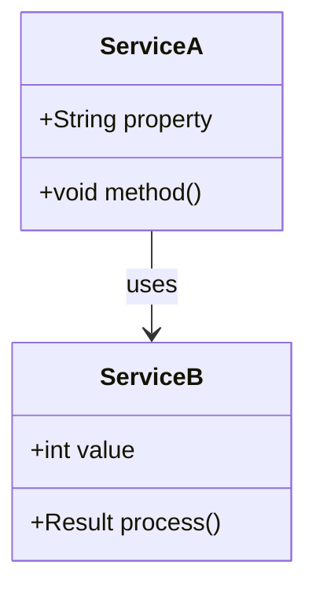

#### Sequence Diagram
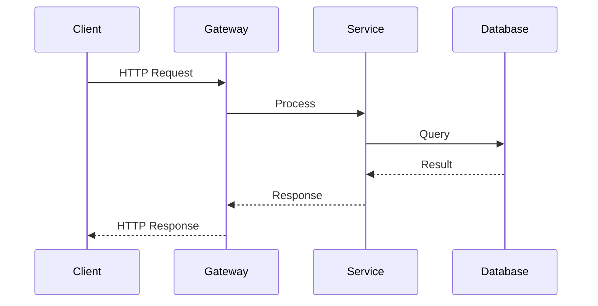

#### Architecture Flow
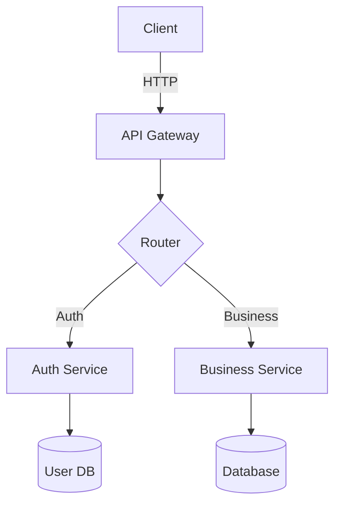

#### State Diagram
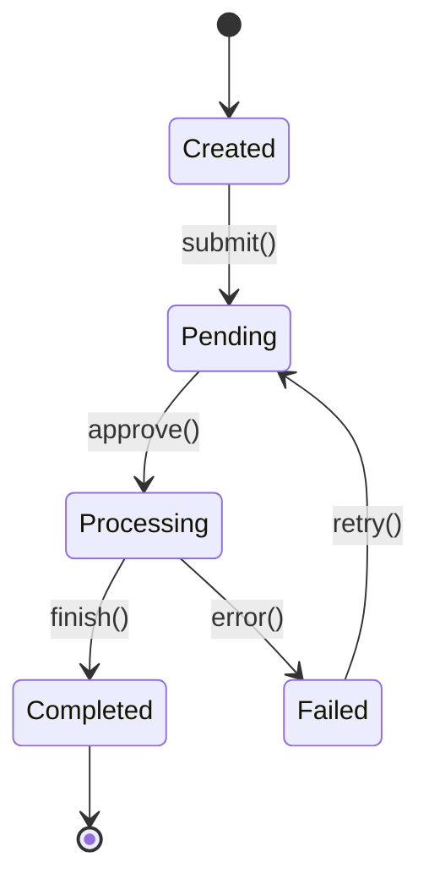

#### Entity Relationship
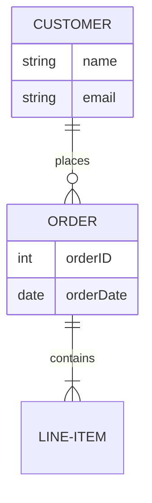

### 2. PlantUML Diagrams

#### Component Diagram
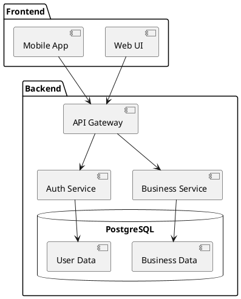

#### Deployment Diagram
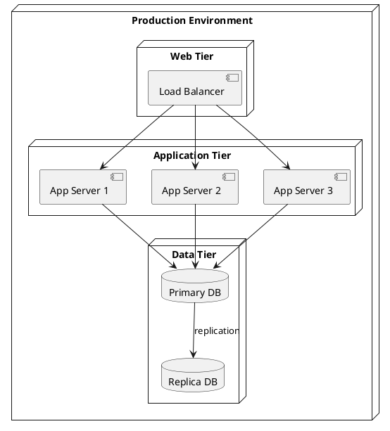

### 3. Python Diagrams (Cloud Architecture)

```python
# AWS Architecture Example
from diagrams import Diagram, Cluster
from diagrams.aws.compute import EC2, Lambda
from diagrams.aws.database import RDS, ElastiCache
from diagrams.aws.network import ELB, Route53

with Diagram("Microservice Architecture", show=False):
    dns = Route53("DNS")
    lb = ELB("Load Balancer")
    
    with Cluster("Application Layer"):
        app_servers = [EC2("App-1"), EC2("App-2"), EC2("App-3")]
    
    with Cluster("Data Layer"):
        primary_db = RDS("Primary")
        replica_db = RDS("Replica")
        cache = ElastiCache("Redis")
    
    dns >> lb >> app_servers
    app_servers >> primary_db
    app_servers >> cache
    primary_db >> replica_db
```

### 4. Graphviz (Complex Relationships)

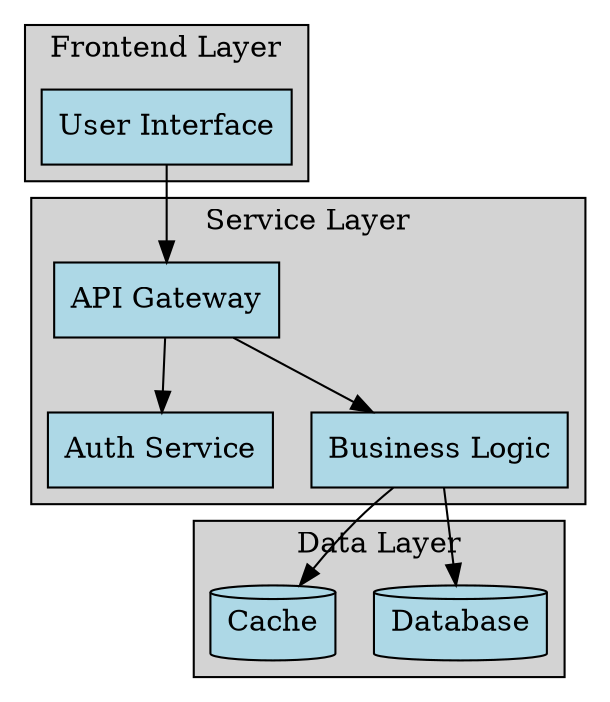

---

## 📐 LLD/HLD Generation Rules

### High-Level Design (HLD) Requirements

#### 1. System Context Diagram
**Must Include:**
- External systems and actors
- System boundaries
- Major integrations
- Data flow directions
- Communication protocols

**Mermaid Template:**
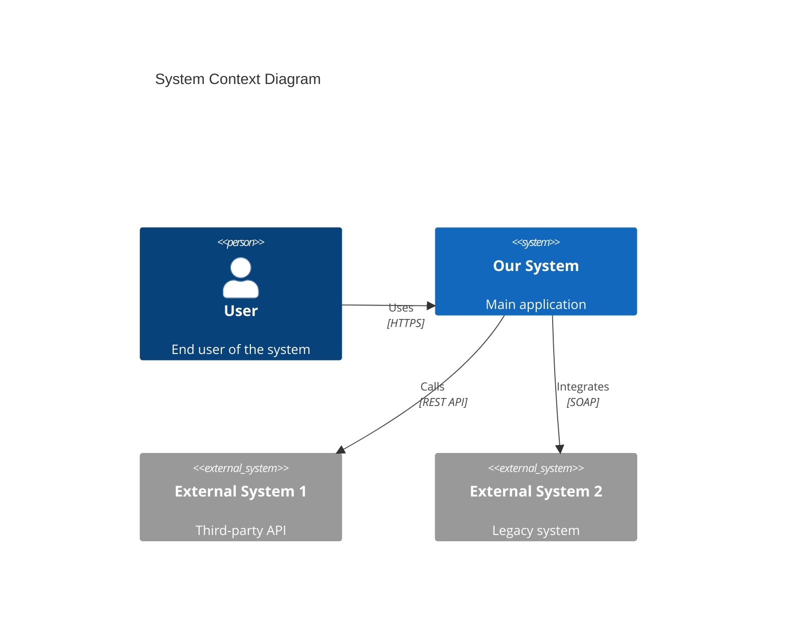

#### 2. Component Architecture
**Must Include:**
- Major components/modules
- Component responsibilities
- Inter-component communication
- Technology stack per component
- Deployment units

**Example:**
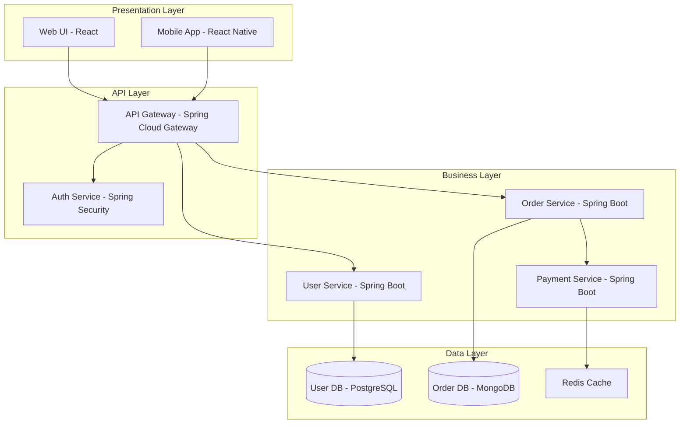

#### 3. Data Flow Diagram
**Must Include:**
- Data sources
- Processing stages
- Data transformations
- Storage points
- Data output/destinations

### Low-Level Design (LLD) Requirements

#### 1. Class Diagrams
**Must Include:**
- All public classes in changed files
- Relationships (inheritance, composition, aggregation)
- Key methods and properties
- Design patterns used
- Annotations/decorators

**Mermaid Template:**
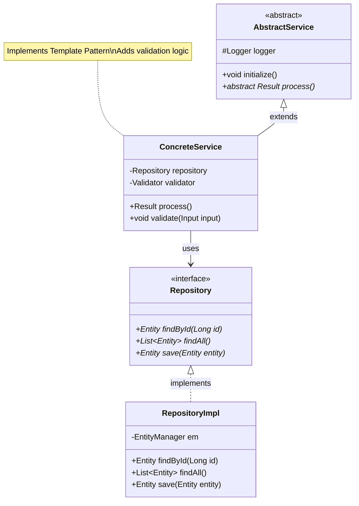

#### 2. Sequence Diagrams
**Must Include:**
- All major operation flows
- Method calls with parameters
- Return values
- Conditional logic
- Error handling flows
- Async operations

**Example:**
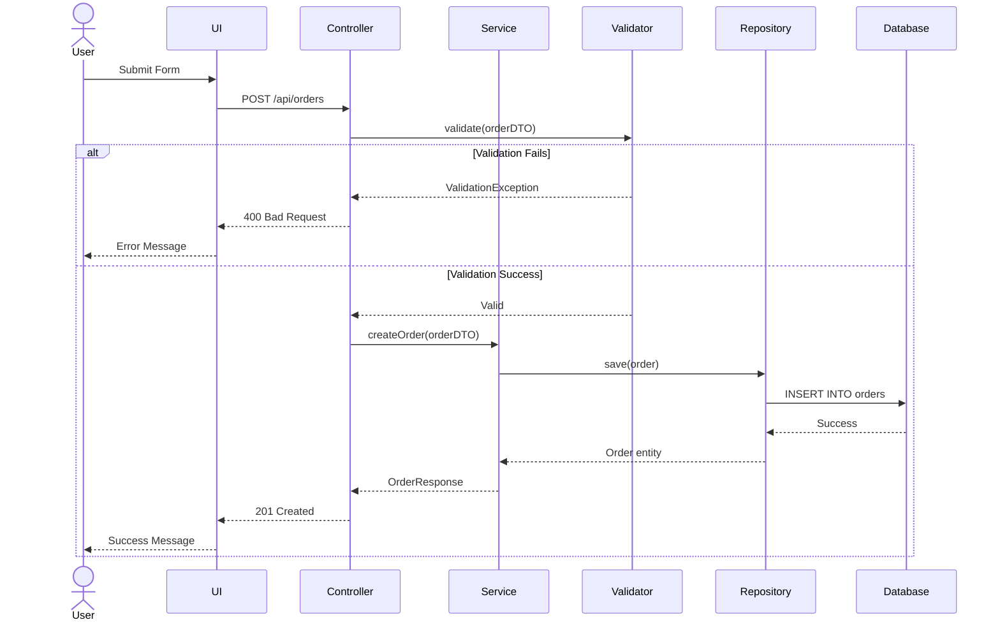

#### 3. State Machine Diagrams
**Must Include:**
- All states
- Transitions with triggers
- Guard conditions
- Entry/exit actions

#### 4. Database Schema
**Must Include:**
- Tables/collections
- Columns/fields with types
- Primary/foreign keys
- Indexes
- Relationships with cardinality

**Mermaid ER Diagram:**
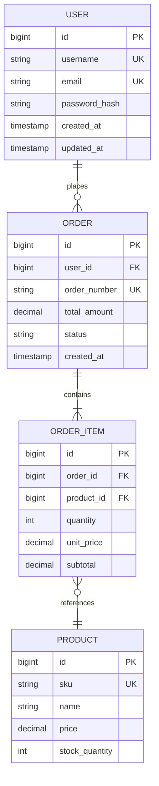

---

## 🎨 Diagram Generation Guidelines

### When to Generate Each Diagram Type

| Diagram Type | Use When | Required For |
|--------------|----------|--------------|
| **System Context** | New microservice, external integration | HLD |
| **Component** | Architecture changes, new modules | HLD |
| **Deployment** | Infrastructure changes, scaling | HLD |
| **Data Flow** | Data processing pipelines | HLD |
| **Class** | New classes, refactoring | LLD |
| **Sequence** | New API endpoints, complex flows | LLD |
| **State Machine** | Stateful entities, workflows | LLD |
| **ER Diagram** | Database schema changes | LLD |
| **Activity** | Business process changes | Both |

### Diagram Quality Standards

✅ **Must Have:**
- Clear labels and descriptions
- Consistent naming conventions
- Proper relationship indicators
- Legend when using custom symbols
- Direction indicators (top-to-bottom, left-to-right)

✅ **Best Practices:**
- Use colors for grouping/categorization
- Keep diagrams focused (max 10-15 elements)
- Use subgraphs for logical grouping
- Add notes for important details
- Use standard UML notation

❌ **Avoid:**
- Overcrowded diagrams
- Missing relationships
- Unclear labels
- Inconsistent notation
- Crossing lines (when possible)

---

## 🧠 AI Agent Instructions for Diagram Generation

### Step 1: Analyze Code Changes
```
FOR each changed file:
    IF new_class OR modified_class:
        → Generate class diagram
    IF new_api_endpoint OR modified_endpoint:
        → Generate sequence diagram
    IF database_migration:
        → Generate ER diagram
    IF architectural_change:
        → Generate component diagram
```

### Step 2: Detect Patterns
```
SCAN codebase FOR:
    - Design patterns (Factory, Strategy, Observer, etc.)
    - Architectural patterns (MVC, Microservices, CQRS, etc.)
    - Integration patterns (API Gateway, Circuit Breaker, etc.)

ANNOTATE diagrams WITH detected patterns
```

### Step 3: Generate Appropriate Diagrams
```
BASED ON change_scope:
    IF scope == "minor_bugfix":
        → Sequence diagram for affected flow
    
    IF scope == "feature_addition":
        → Class diagram for new classes
        → Sequence diagram for new flows
        → Update architecture diagram
    
    IF scope == "major_refactoring":
        → Before/After class diagrams
        → Component diagram showing changes
        → Migration sequence diagram
    
    IF scope == "new_microservice":
        → Full LLD + HLD documentation
        → System context diagram
        → Component architecture
        → All relevant class/sequence diagrams
```

### Step 4: Embed Diagrams
```
IN documentation:
    1. Place HLD diagrams in "Architecture" section
    2. Place LLD diagrams in "Technical Implementation" section
    3. Place sequence diagrams near relevant code examples
    4. Place ER diagrams in "Database Changes" section
    5. Always provide Mermaid source code in collapsible sections
```

---

## 🔧 Diagram Tools Setup

### Mermaid (Recommended - No Installation)
**Advantages:**
- ✅ Native GitHub/GitLab support
- ✅ Renders in Markdown
- ✅ No external tools needed
- ✅ Text-based (version controllable)
- ✅ Easy to update

**Usage in Markdown:**
````markdown
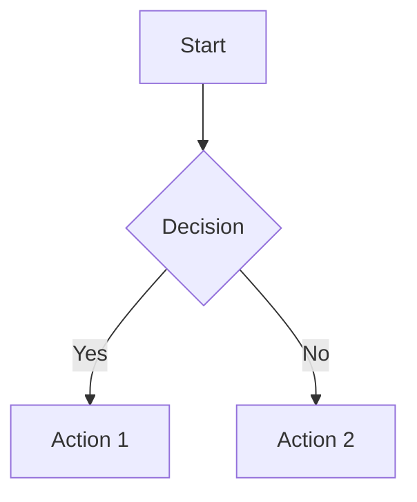
````

### PlantUML (Advanced)
**Installation:**
```bash
# Option 1: VS Code Extension
Install "PlantUML" extension

# Option 2: Command Line
brew install plantuml  # Mac
choco install plantuml # Windows
```

**Usage:**
```bash
# Generate PNG
plantuml diagram.puml

# Generate SVG
plantuml -tsvg diagram.puml
```

### Python Diagrams (Cloud Architecture)
**Installation:**
```bash
pip install diagrams
```

**Usage:**
```python
from diagrams import Diagram
from diagrams.aws.compute import EC2

with Diagram("My Architecture", show=False, filename="output"):
    EC2("Web Server")
```

### Graphviz
**Installation:**
```bash
brew install graphviz  # Mac
choco install graphviz # Windows
```

**Usage:**
```bash
dot -Tpng architecture.dot -o architecture.png
```

---

## 📋 Universal Documentation Template with Diagrams

```markdown
# [FEATURE]: [Description]

## 1. Executive Summary
[2-3 paragraphs]

### Key Changes
- ✅ [Change 1]
- ✅ [Change 2]

---

## 2. High-Level Design (HLD)

### 2.1 System Context
```mermaid
[System context diagram]
```

### 2.2 Component Architecture
```mermaid
[Component diagram]
```

### 2.3 Data Flow
```mermaid
[Data flow diagram]
```

### 2.4 Deployment Architecture
```mermaid
[Deployment diagram]
```

---

## 3. Low-Level Design (LLD)

### 3.1 Class Structure
```mermaid
[Class diagram for main components]
```

### 3.2 Sequence Flows

#### 3.2.1 Happy Path Flow
```mermaid
[Sequence diagram - success case]
```

#### 3.2.2 Error Handling Flow
```mermaid
[Sequence diagram - error cases]
```

### 3.3 State Transitions
```mermaid
[State diagram if applicable]
```

### 3.4 Database Schema
```mermaid
[ER diagram]
```

---

## 4. Code Changes Analysis

### 4.1 New Classes

#### 4.1.1 ClassName.java
**Location:** `com/example/ClassName.java`

**Class Diagram:**
```mermaid
classDiagram
    [Focused class diagram]
```

**Code:**
```java
[Code snippet]
```

**Purpose:**
- [Explanation]

---

## 5. API Changes

### 5.1 New Endpoints

#### POST /api/resource
**Sequence:**
```mermaid
[API sequence diagram]
```

**Request/Response:**
```json
{
  "request": "example"
}
```

---

## 6. Integration Points

### 6.1 External Systems
```mermaid
[Integration diagram]
```

---

## 7. Security Considerations
```mermaid
[Security flow diagram]
```

---

## 8. Performance Considerations
```mermaid
[Performance architecture]
```

---

## 9. Deployment Guide
```mermaid
[Deployment flow]
```

---

## 10. Monitoring & Observability
```mermaid
[Monitoring architecture]
```

---

## 11. Rollback Plan
```mermaid
[Rollback sequence]
```

---

## Appendix A: Diagram Sources

<details>
<summary>Mermaid Source Code</summary>

### System Context
```mermaid
[Full source]
```

### Component Architecture
```mermaid
[Full source]
```

</details>
```

---

## 🎯 AI Prompt Template for Ultimate Docs

```
Generate comprehensive PR documentation for story [STORY-ID] 
comparing branches [SOURCE] and [TARGET].

Requirements:
1. Analyze all code changes in: [LANGUAGE]
2. Generate HLD diagrams:
   - System context diagram (Mermaid)
   - Component architecture (Mermaid)
   - Data flow diagram (Mermaid)
3. Generate LLD diagrams:
   - Class diagrams for top 10 changed classes (Mermaid)
   - Sequence diagrams for new/modified flows (Mermaid)
   - ER diagram if database changes (Mermaid)
   - State diagrams for stateful entities (Mermaid)
4. Follow documentation template from .github/DOCUMENTATION_TEMPLATE.md
5. Include 10-15 code examples
6. Embed all diagrams inline with collapsible source code
7. Generate before/after diagrams for major refactoring
8. Annotate diagrams with design patterns
9. Include deployment architecture
10. Add security flow diagrams

Output format: Markdown with embedded Mermaid diagrams
Quality: Production-ready, reviewer-friendly, stakeholder-ready
```

---

## 📊 Diagram Selection Matrix

| Change Type | HLD Diagrams | LLD Diagrams |
|-------------|-------------|--------------|
| **New Microservice** | System Context, Component, Deployment, Data Flow | Class, Sequence, State, ER |
| **API Addition** | Component (updated) | Class, Sequence |
| **Database Schema** | Data Flow | ER, Migration Sequence |
| **Refactoring** | Component (before/after) | Class (before/after), Sequence |
| **Bug Fix** | None (unless architecture) | Sequence (affected flow) |
| **Security** | Security Architecture | Security Sequence, Access Control |
| **Performance** | Performance Architecture | Caching Sequence, Optimization Flow |
| **Integration** | Integration Architecture | Integration Sequence |

---

## 🌍 Universal Language Support

### Language-Specific Diagram Rules

#### Java/Spring
```
MUST INCLUDE:
- @Component, @Service, @Repository annotations in class diagrams
- Spring Bean lifecycle in sequence diagrams
- AOP pointcuts if present
- JPA relationships in ER diagrams
```

#### Python/Django
```
MUST INCLUDE:
- Class inheritance (views, models, serializers)
- Django ORM relationships in ER diagrams
- Middleware flow in sequence diagrams
- Celery task flows if async
```

#### JavaScript/TypeScript/Node
```
MUST INCLUDE:
- Module dependencies
- Async/Promise flows in sequence diagrams
- Express middleware chain
- React component hierarchy (if frontend)
```

#### C#/.NET
```
MUST INCLUDE:
- Interface implementations
- Dependency injection in sequence
- Entity Framework relationships
- Middleware pipeline
```

#### Go
```
MUST INCLUDE:
- Interface implementations
- Goroutine concurrency in sequence
- Channel communication
- Error handling flows
```

---

## ✅ Quality Checklist with Diagrams

### HLD Checklist
- [ ] System context diagram present
- [ ] All external systems shown
- [ ] Component architecture complete
- [ ] Data flow illustrated
- [ ] Deployment architecture documented
- [ ] Technology stack specified
- [ ] Integration points clear

### LLD Checklist
- [ ] Class diagrams for key classes (10+)
- [ ] Sequence diagrams for main flows (5+)
- [ ] State diagrams for stateful entities
- [ ] ER diagram if DB changes
- [ ] All relationships documented
- [ ] Design patterns annotated
- [ ] Error flows documented

### Diagram Quality
- [ ] All diagrams render correctly
- [ ] Labels are clear and consistent
- [ ] Relationships properly indicated
- [ ] Colors used meaningfully
- [ ] No overcrowding (<15 elements)
- [ ] Source code in collapsible sections
- [ ] Diagrams match code reality

---

## 🚀 Performance Optimization

### Diagram Generation Performance
- Use Mermaid for fast rendering (browser-native)
- Cache generated diagrams
- Lazy-load complex diagrams
- Generate SVG for better quality
- Use CDN for diagram libraries

### AI Processing Optimization
- Parallel processing of file analysis
- Incremental diagram updates
- Cached pattern recognition
- Smart change detection
- Progressive documentation generation

---

**Version:** 2.0 (Ultimate Edition with Diagrams)  
**Last Updated:** January 9, 2026  
**Status:** 🚀 Production Ready with Full Diagram Support

