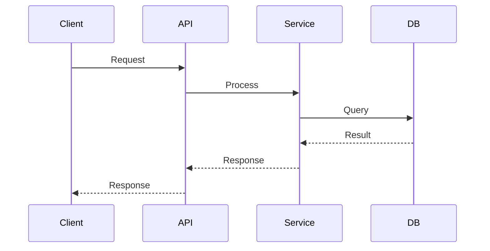

# 📋 Ultimate AI Documentation System - Quick Reference Card

## ⚡ Generate Documentation with Diagrams in 3 Steps

### Option 1: Ultimate AI-Powered (15-30 minutes) 🤖 **RECOMMENDED**
```powershell
# Step 1: Run ultimate script with diagram generation
.\.github\scripts\generate-ultimate-docs.ps1 `
    -SourceBranch "base" `
    -TargetBranch "feature" `
    -StoryId "PROJ-123" `
    -GenerateDiagrams $true `
    -DiagramFormat "mermaid"

# Step 2: Copy AI prompt from generated file
cat .github/docs/archives/PROJ-123/AI_PROMPT.txt

# Step 3: Paste into AI (Copilot/ChatGPT/Claude)
"Generate documentation with LLD/HLD diagrams using the prompt above"

# Output: Complete docs with embedded Mermaid diagrams!
```

### Option 2: Standard Automated (30 minutes)
```powershell
# Step 1: Run standard script
.\.github\scripts\generate-documentation-analysis.ps1 -SourceBranch "base" -TargetBranch "feature" -StoryId "PROJ-123"

# Step 2: Use Copilot
"Generate documentation using .github/COPILOT_INSTRUCTIONS.md for story PROJ-123"

# Step 3: Review & Publish
Use .github/DOCUMENTATION_CHECKLIST.md
```

### Option 2: AI-Assisted (1-2 hours)
```
Step 1: git diff base..feature --name-status
Step 2: Open Copilot → Reference COPILOT_INSTRUCTIONS.md
Step 3: Review checklist → Publish
```

### Option 3: Manual (4-8 hours)
```
Step 1: Follow DOCUMENTATION_GUIDE.md (30 steps)
Step 2: Use DOCUMENTATION_CHECKLIST.md (49 sections)
Step 3: Fill DOCUMENTATION_TEMPLATE.md
```

---

## 🎨 NEW: Diagram Generation Capabilities

### Automatic LLD/HLD Diagrams
- ✅ **Mermaid** - Class, Sequence, Flow, State, ER diagrams
- ✅ **PlantUML** - Component, Deployment diagrams  
- ✅ **Universal Language** - Java, Python, JS/TS, C#, Go, Rust, Kotlin
- ✅ **AI-Powered** - Automatic architecture inference

### Diagram Types Generated
| Type | When | Example |
|------|------|---------|
| **System Context** | New service/integration | Shows external systems |
| **Component** | Architecture changes | Module relationships |
| **Class** | New/modified classes | Object structure |
| **Sequence** | New flows/APIs | Method interactions |
| **ER** | Database changes | Table relationships |
| **State** | Stateful entities | Lifecycle transitions |

### Quick Mermaid Example
````markdown

````

---

## 📁 File Structure (Enhanced)
```
.github/
├── README.md                                # Overview & getting started
├── SYSTEM_SUMMARY.md                        # Complete system documentation  
├── QUICK_REFERENCE.md                       # This file
├── AI_DOCUMENTATION_AGENT.md               # 🆕 Ultimate AI agent with LLD/HLD
├── COPILOT_INSTRUCTIONS.md                 # AI prompt (19.7 KB)
├── DOCUMENTATION_GUIDE.md                  # 30-step guide (17.8 KB)
├── DOCUMENTATION_CHECKLIST.md              # 200+ items (19.1 KB)
├── DOCUMENTATION_TEMPLATE.md               # Template (12.3 KB)
└── scripts/
    ├── generate-ultimate-docs.ps1          # 🆕 Ultimate with diagrams
    └── generate-documentation-analysis.ps1  # Standard automation
```

---

## 🎯 Essential Commands

### Ultimate Analysis Script (with Diagrams)
```powershell
.\.github\scripts\generate-ultimate-docs.ps1 `
    -SourceBranch "origin/main" `
    -TargetBranch "feature/my-work" `
    -StoryId "STORY-123" `
    -StoryTitle "Feature Description" `
    -GenerateDiagrams $true `
    -DiagramFormat "mermaid"
```

### Standard Analysis Script
```powershell
.\.github\scripts\generate-documentation-analysis.ps1 `
    -SourceBranch "origin/main" `
    -TargetBranch "feature/my-work" `
    -StoryId "STORY-123" `
    -StoryTitle "Feature Description"
```

### Git Analysis
```bash
# Statistics
git diff branch1..branch2 --shortstat

# File list
git diff branch1..branch2 --name-status

# Commits
git log branch1..branch2 --oneline --no-merges

# File diff
git diff branch1..branch2 -- "path/to/file"
```

### AI Documentation Prompt
```
Generate comprehensive Confluence documentation with LLD/HLD diagrams for story [STORY-ID] 
comparing branches [source] and [target].

Follow:
- Template: .github/DOCUMENTATION_TEMPLATE.md
- Guidelines: .github/AI_DOCUMENTATION_AGENT.md  
- Instructions: .github/COPILOT_INSTRUCTIONS.md

Include:
- 10-15 code examples from key classes
- Mermaid diagrams: System Context, Component, Class (10+), Sequence (5+)
- ER diagram if database changes
- State diagrams for stateful entities
- Before/after diagrams for refactoring

Output: [STORY-ID]_ULTIMATE_ANALYSIS_CONFLUENCE_DOC.md
```

---

## ✅ Quality Checklist

**Minimum Requirements:**
- [ ] 21 sections complete
- [ ] 10-15 code examples
- [ ] All files documented
- [ ] Commit history included
- [ ] Dependencies listed
- [ ] Testing described
- [ ] Peer reviewed
- [ ] Published & linked

**File Naming:**
`[STORY_ID]_[FEATURE]_ANALYSIS_CONFLUENCE_DOC.md`

**Example:**
`G1198_16064_FLOW_FRAMEWORK_ANALYSIS_CONFLUENCE_DOC.md`

---

## 📊 Output Structure

```markdown
# [Feature]: [Description]

## 1. Executive Summary
## 2. Architecture
## 3. Detailed Changes
## 4. Key Classes (10-15 with code)
## 5. Technical Implementation
## 6. Dependencies
## 7. Testing
## 8. Benefits
## 9. Commit History
## 10. File Summary
## 11. Next Steps
## 12. Risks
## 13-19. [Additional sections]
```

---

## 🎓 Quick Start for New Users

1. **Read:** `.github/README.md` (10 min)
2. **Run:** Analysis script (5 min)
3. **Review:** Generated files (10 min)
4. **Generate:** With Copilot (30-60 min)
5. **Checklist:** Verify completeness (15 min)
6. **Publish:** Commit & share (10 min)

**Total: 1.5-2 hours**

---

## 🔧 Common Tasks

### Update Existing Documentation
```
1. Review feedback/comments
2. Update relevant sections
3. Re-run checklist
4. Commit changes
```

### Archive Analysis Files
```
Location: .github/docs/archives/[STORY_ID]/
Contains: 9 analysis files + README
```

### Get Help
```
Troubleshooting: See DOCUMENTATION_GUIDE.md
Questions: Check README.md
Support: Contact team lead
```

---

## 📈 Time Savings

| Method | Time | Diagrams | vs Manual |
|--------|------|----------|-----------|
| **Ultimate AI** | 15-30 min | ✅ Auto | 95% faster |
| Automated | 30 min | ❌ | 93% faster |
| AI-Assisted | 1-2 hrs | Manual | 75% faster |
| Manual | 4-8 hrs | Manual | Baseline |

---

## 💡 Pro Tips

✅ Run analysis script first  
✅ Review all 9 generated files  
✅ Use Copilot for bulk content  
✅ Manual refine for accuracy  
✅ Always peer review  
✅ Link from PR and JIRA  
✅ Archive analysis files  

❌ Don't skip analysis phase  
❌ Don't use placeholder code  
❌ Don't skip peer review  
❌ Don't forget to publish  

---

## 🎯 Success Metrics

- **Completeness:** 100% of sections
- **Code Examples:** 10-15 minimum
- **Quality Score:** 95%+ via checklist
- **Review Time:** <1 hour
- **Stakeholder Satisfaction:** High

---

## 🔗 Quick Links

- [Main README](.github/README.md)
- [System Summary](.github/SYSTEM_SUMMARY.md)
- [🆕 AI Documentation Agent](.github/AI_DOCUMENTATION_AGENT.md) - **With Diagrams!**
- [Copilot Instructions](.github/COPILOT_INSTRUCTIONS.md)
- [Step-by-Step Guide](.github/DOCUMENTATION_GUIDE.md)
- [Comprehensive Checklist](.github/DOCUMENTATION_CHECKLIST.md)
- [Template](.github/DOCUMENTATION_TEMPLATE.md)
- [🆕 Ultimate Script](.github/scripts/generate-ultimate-docs.ps1) - **With Diagrams!**
- [Standard Script](.github/scripts/generate-documentation-analysis.ps1)

---

**Print this card and keep it handy! 📌**

**Version:** 2.0 (Ultimate Edition with Diagrams) | **Date:** January 9, 2026

