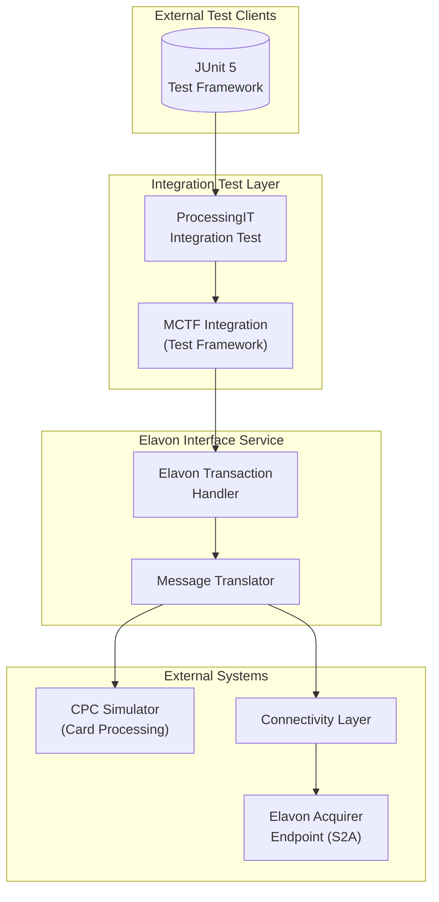

# ProcessingIT System Context Diagram

## Overview
This diagram shows the high-level system context for the ProcessingIT integration test, illustrating how external systems interact with the Elavon Acquirer Interface Service.

## System Actors

| Actor | Description |
|-------|-------------|
| JUnit 5 | Test framework executing dynamic tests |
| ProcessingIT | Main integration test class |
| MCTF Integration | Mastercard Test Framework for model-based testing |
| Elavon Service | Core transaction handling service |
| CPC Simulator | Card Processing Component simulator |
| Connectivity Layer | Message routing layer |
| Elavon Acquirer (S2A) | External acquirer endpoint |

## Key Interactions

1. **Test Initiation**: JUnit triggers ProcessingIT test factory
2. **Model Loading**: MCTF loads ElavonSystemTransactions model
3. **Test Execution**: Dynamic tests generated from flow model
4. **Request Processing**: Transaction requests flow through layers
5. **Response Handling**: Responses validated against expected model
