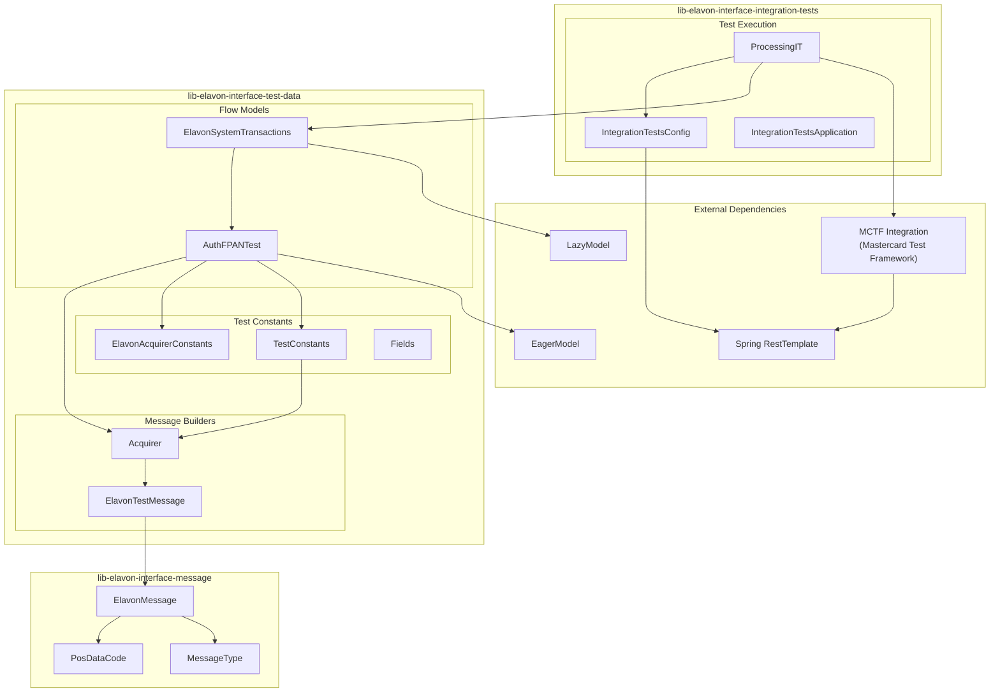
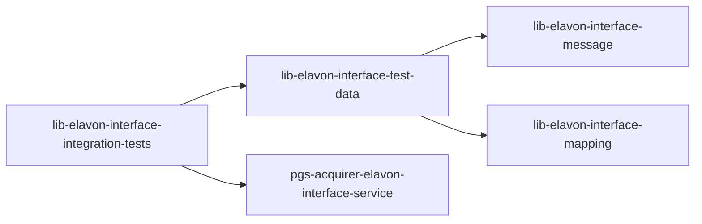

# ProcessingIT Component Architecture Diagram

## Overview
This diagram illustrates the component architecture and module dependencies within the ProcessingIT integration test framework.

## Component Descriptions

| Component | Module | Purpose |
|-----------|--------|---------|
| ProcessingIT | integration-tests | Main test class with @TestFactory |
| IntegrationTestsConfig | integration-tests | Spring test configuration |
| ElavonSystemTransactions | test-data | Model container defining test flows |
| AuthFPANTest | test-data | Auth FPAN test scenarios for S2A |
| TestConstants | test-data | Common test request/response builders |
| Acquirer | test-data | Acquirer message definitions |
| ElavonMessage | message | ISO 8583 message structure |
| MCTF Integration | external | Mastercard test framework |

## Module Dependencies

