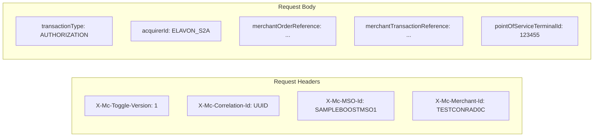
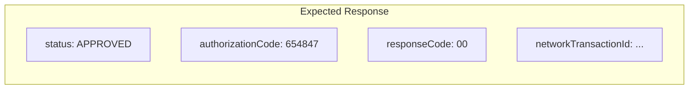

# ProcessingIT Data Flow Diagram

## Overview
This diagram shows the complete data flow through the ProcessingIT integration test, from test initialization to response validation.

```mermaid
flowchart TB
    subgraph "Test Initialization"
        A[JUnit 5 Engine] -->|@TestFactory| B[ProcessingIT.componentTests]
        B -->|Load Model| C[ElavonSystemTransactions.MODEL]
        C -->|LazyModel with| D[AuthFPANTest.class]
    end
    
    subgraph "Model Building"
        D -->|Extends EagerModel| E[AuthFPANTest Constructor]
        E -->|Creates| F[authMandatoryFields Flow]
        F -->|Uses Deriver.build| G[Base Auth Flow from AuthFPAN]
    end
    
    subgraph "Flow Configuration"
        G -->|Update CPC| H[CPC Interaction]
        G -->|Update CONNECTIVITY| I[Connectivity Interaction]
        G -->|Update ACQUIRER| J[Acquirer Interaction]
        
        H -->|Request Fields| H1[transactionType, acquirerId,<br/>merchantOrderReference, etc.]
        I -->|Request Fields| I1[transactionId, submissionTimestamp,<br/>toggleVersion, etc.]
        J -->|Request Fields| J1[ISO 8583 Fields:<br/>63.50 - 3DSecure Indicator]
    end
    
    subgraph "Test Execution"
        K[MCTF Integration] -->|Creates| L[Stream of DynamicNode]
        L -->|For Each Flow| M[Execute Test Case]
        M -->|Via RestTemplate| N[HTTP Request]
    end
    
    subgraph "Request Processing"
        N -->|Send Request| O[ElavonTransactionHandler]
        O -->|Build Message| P[ElavonRequestResponseBuilder]
        P -->|ISO 8583| Q[Elavon Message Format]
    end
    
    subgraph "Response Validation"
        Q -->|Response| R[Parse ISO 8583 Response]
        R -->|Map to| S[TSPIResponse]
        S -->|Validate Against| T[Expected Flow Response]
        T -->|Assert| U[Test Result: Pass/Fail]
    end
    
    C --> K
    J --> M
```

## Data Flow Stages

### 1. Test Initialization
| Step | Input | Output | Description |
|------|-------|--------|-------------|
| 1.1 | JUnit @TestFactory | ProcessingIT | JUnit discovers test factory method |
| 1.2 | MODEL constant | LazyModel | Model initialization with AuthFPANTest |
| 1.3 | RestTemplate | Integration | MCTF Integration instance created |

### 2. Flow Model Construction
| Step | Input | Output | Description |
|------|-------|--------|-------------|
| 2.1 | AuthFPAN.newAuth | Base Flow | Inherit from base authorization flow |
| 2.2 | getBaseInteraction() | Deriver | Apply Elavon-specific customizations |
| 2.3 | CPC/CONNECTIVITY/ACQUIRER updates | Complete Flow | Add all interaction layers |

### 3. Request Data


### 4. Response Data

