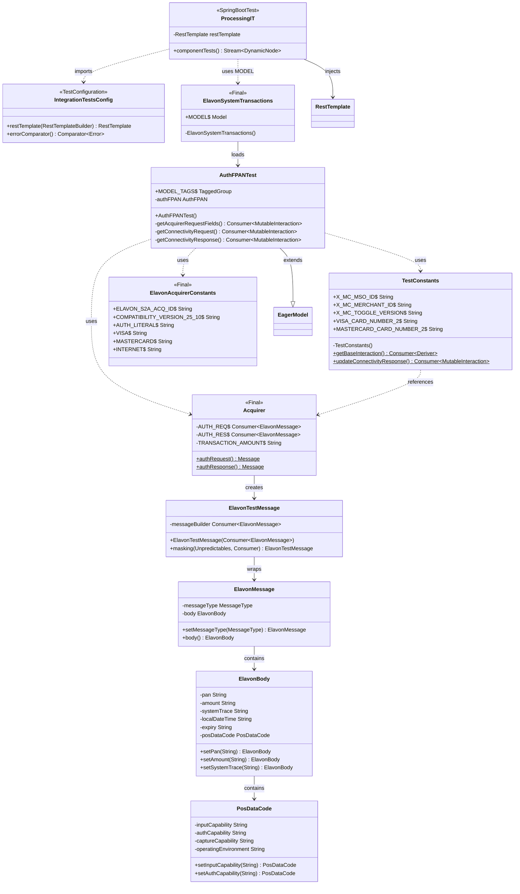
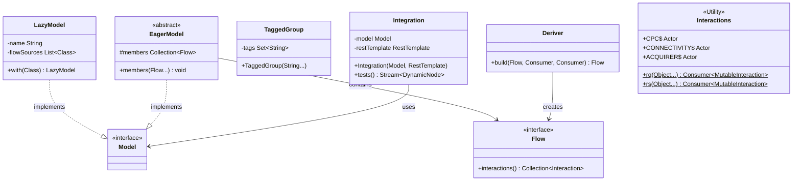

# ProcessingIT Class Diagram

## Overview
This diagram shows the class structure and relationships for the ProcessingIT integration test components.



## External Dependencies



## Package Structure

```
lib-elavon-interface-integration-tests/
├── src/test/java/.../test/
│   ├── ProcessingIT.java
│   └── IntegrationTestsConfig.java

lib-elavon-interface-test-data/
├── src/main/java/.../flow/
│   ├── ElavonSystemTransactions.java
│   ├── model/
│   │   └── AuthFPANTest.java
│   ├── constant/
│   │   ├── TestConstants.java
│   │   ├── ElavonAcquirerConstants.java
│   │   └── Fields.java
│   ├── msg/
│   │   └── Acquirer.java
│   └── utility/
│       └── ElavonUtil.java

lib-elavon-interface-message/
├── src/main/java/.../message/
│   ├── ElavonMessage.java
│   ├── ElavonBody.java
│   ├── MessageType.java
│   └── PosDataCode.java
```
