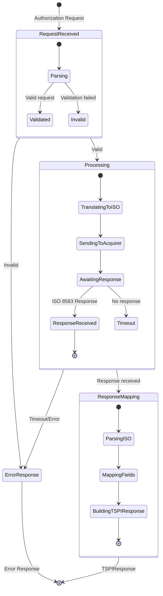

# ProcessingIT State Diagram

## Overview
This diagram shows the state transitions during ProcessingIT test execution.

```mermaid
stateDiagram-v2
    [*] --> TestDiscovery: JUnit Starts
    
    state TestDiscovery {
        [*] --> ScanningTestClasses
        ScanningTestClasses --> FoundTestFactory: @TestFactory found
        FoundTestFactory --> [*]
    }
    
    TestDiscovery --> SpringContextInit: ProcessingIT discovered
    
    state SpringContextInit {
        [*] --> LoadingConfig
        LoadingConfig --> CreatingBeans: @Import IntegrationTestsConfig
        CreatingBeans --> RestTemplateReady: RestTemplate bean created
        RestTemplateReady --> [*]
    }
    
    SpringContextInit --> ModelLoading: Context ready
    
    state ModelLoading {
        [*] --> LazyModelInit
        LazyModelInit --> AuthFPANTestConstruct: First access
        AuthFPANTestConstruct --> FlowsBuilt: Deriver.build()
        FlowsBuilt --> [*]
    }
    
    ModelLoading --> TestGeneration: Model ready
    
    state TestGeneration {
        [*] --> MCTFInit
        MCTFInit --> ParsingFlows: Integration(MODEL, restTemplate)
        ParsingFlows --> DynamicTestsCreated: .tests()
        DynamicTestsCreated --> [*]
    }
    
    TestGeneration --> TestExecution: Stream<DynamicNode>
    
    state TestExecution {
        [*] --> ExecutingTest
        ExecutingTest --> SendingRequest: HTTP Request
        SendingRequest --> AwaitingResponse
        AwaitingResponse --> ValidatingResponse: Response received
        ValidatingResponse --> TestPassed: Match
        ValidatingResponse --> TestFailed: Mismatch
        TestPassed --> NextTest
        TestFailed --> NextTest
        NextTest --> ExecutingTest: More tests
        NextTest --> [*]: All done
    }
    
    TestExecution --> ReportGeneration: All tests complete
    
    state ReportGeneration {
        [*] --> AggregatingResults
        AggregatingResults --> GeneratingReport
        GeneratingReport --> [*]
    }
    
    ReportGeneration --> [*]: Test Report
```

## Transaction State Flow

## State Descriptions

| State | Description |
|-------|-------------|
| TestDiscovery | JUnit scans for @TestFactory methods |
| SpringContextInit | Spring Boot test context initialization |
| ModelLoading | Lazy loading of test flow models |
| TestGeneration | MCTF creates dynamic test nodes |
| TestExecution | Each test case executed |
| RequestReceived | Transaction request arrives |
| Processing | ISO 8583 message processing |
| ResponseMapping | Map response to TSPI format |
