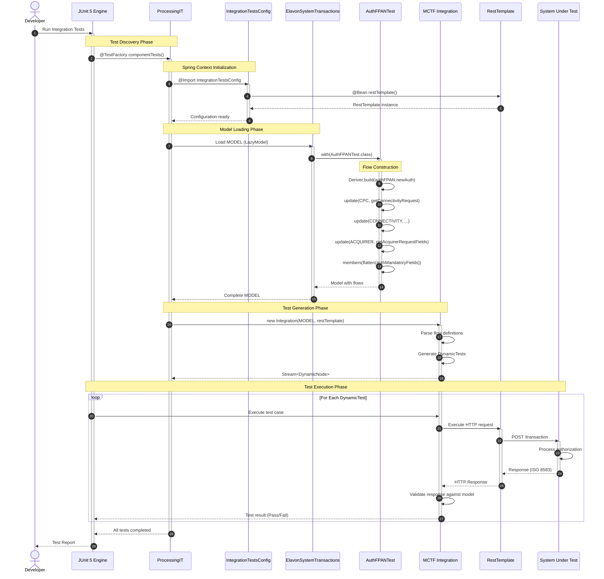

# ProcessingIT Test Execution Sequence Diagram

## Overview
This sequence diagram shows the complete test execution flow for ProcessingIT integration test.



## Sequence Steps Explained

| Step | Phase | Description |
|------|-------|-------------|
| 1-2 | Discovery | JUnit discovers @TestFactory method |
| 3-6 | Configuration | Spring context loads, RestTemplate bean created |
| 7-14 | Model Loading | Lazy model loads AuthFPANTest flows |
| 15-17 | Test Generation | MCTF creates dynamic tests from flows |
| 18-24 | Execution | Each test case executed via HTTP |
| 25-26 | Completion | Results aggregated and reported |

## Key Method Calls

### ProcessingIT.componentTests()
```java
@TestFactory
Stream<DynamicNode> componentTests() {
    return new Integration(ElavonSystemTransactions.MODEL, restTemplate).tests();
}
```

### AuthFPANTest Constructor
```java
Flow authMandatoryFields = Deriver.build(authFPAN.newAuth, getBaseInteraction(),
    flow -> flow
        .meta(data -> data.description("New Base Auth request"))
        .update(CPC, getConnectivityRequest(), rq(...), getConnectivityResponse())
        .update(Interactions.CONNECTIVITY, getConnectivityRequest(), getConnectivityResponse())
        .update(Interactions.ACQUIRER, getAcquirerRequestFields()));
```
