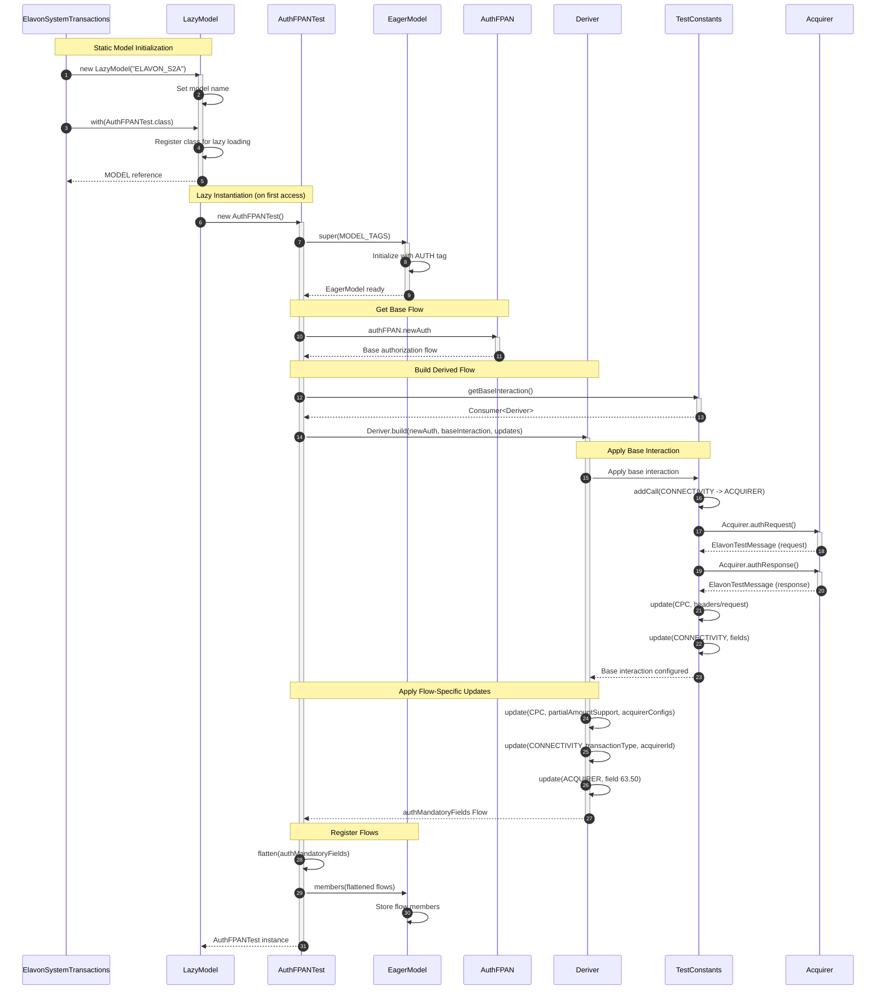
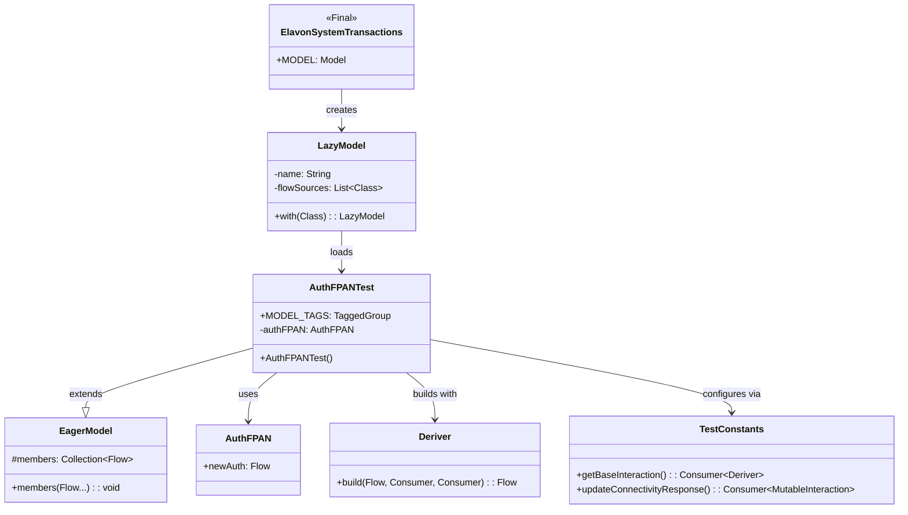

# ProcessingIT Model Construction Sequence

## Overview
This diagram details how the test model is constructed from ElavonSystemTransactions through AuthFPANTest.

## Model Structure

## Key Data Transformations

| Source | Transformation | Target |
|--------|---------------|--------|
| AuthFPAN.newAuth | Deriver.build() | authMandatoryFields |
| getBaseInteraction() | Apply CPC/CONNECTIVITY/ACQUIRER updates | Complete flow |
| Flow | flatten() | Collection of executable tests |
