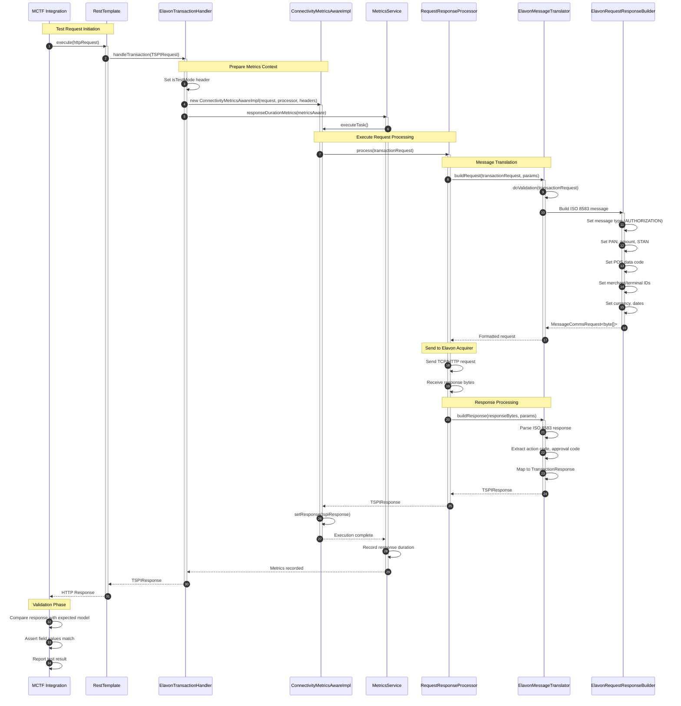
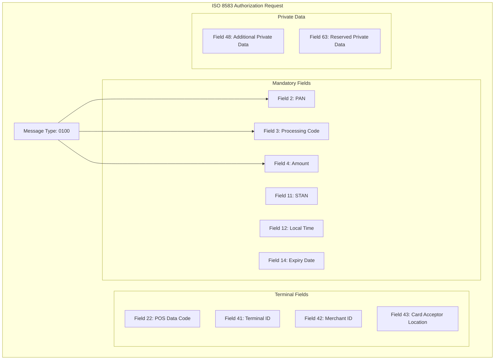
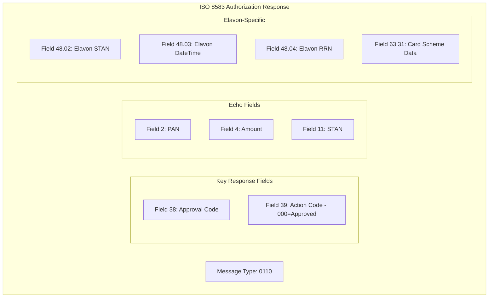

# ProcessingIT Request/Response Flow Sequence

## Overview
This diagram shows the detailed request/response processing flow during test execution.

## Request Message Structure

## Response Message Structure

## Field Mapping Table

| Request Field | Description | Test Value |
|--------------|-------------|------------|
| Field 2 (PAN) | Card number | 5212345678901234 |
| Field 4 (Amount) | Transaction amount | 000000002112 ($21.12) |
| Field 11 (STAN) | System trace audit number | 012345 |
| Field 41 (Terminal ID) | POS terminal identifier | 00123455 |
| Field 42 (Merchant ID) | Merchant identifier | M12345 |
| Field 49 (Currency) | Transaction currency | 840 (USD) |

| Response Field | Description | Expected Value |
|---------------|-------------|----------------|
| Field 38 | Authorization code | 123456 |
| Field 39 | Action/Response code | 000 (Approved) |
| Field 48.02 | Elavon STAN | 654321 |
| Field 63.31 | UTRN | utrn1236325 |
