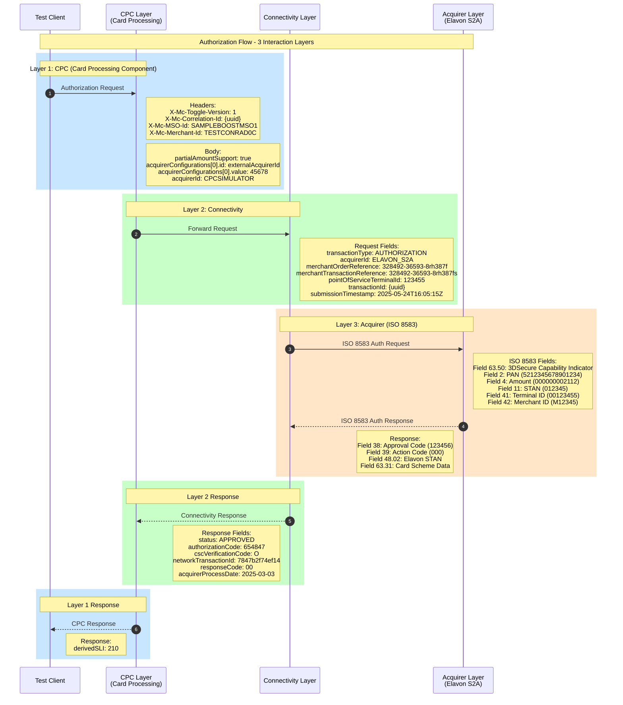
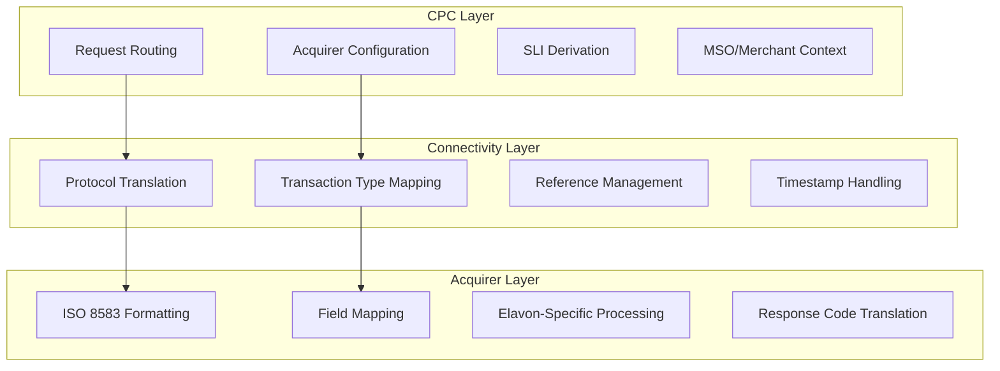

# ProcessingIT Interaction Layers Sequence

## Overview
This diagram shows how the three interaction layers (CPC, CONNECTIVITY, ACQUIRER) work together in the test flow.



## Layer Responsibilities



## Interaction Configuration

### CPC Layer Configuration
```java
.update(CPC,
    getConnectivityRequest(),
    rq("partialAmountSupport", true,
        "acquirerConfigurations[0].id", "externalAcquirerId",
        "acquirerConfigurations[0].value", "45678",
        ACQUIRERID, "CPCSIMULATOR"),
    getConnectivityResponse())
```

### Connectivity Layer Configuration
```java
.update(Interactions.CONNECTIVITY,
    rq(HttpMsg.header(X_MC_TOGGLE_VERSION), "1",
        TRANSACTION_ID, tranId,
        SUBMISSION_TIMESTAMP, "2025-05-24T16:05:15Z"),
    rs("configurationParams", DELETE,
        "derivedRequestServiceProviderParams", DELETE,
        STATUS, APPROVED))
```

### Acquirer Layer Configuration
```java
.update(Interactions.ACQUIRER, 
    rq(SIXTY_THREE_FIFTY, THREE_DSECURE_CAPABILITY_INDICATOR))
```

## Test Data Values Summary

| Layer | Field | Value |
|-------|-------|-------|
| CPC | MSO ID | SAMPLEBOOSTMSO1 |
| CPC | Merchant ID | TESTCONRAD0C |
| CONN | Acquirer ID | ELAVON_S2A |
| CONN | Transaction Type | AUTHORIZATION |
| ACQ | PAN | 5212345678901234 |
| ACQ | Amount | $21.12 |
| ACQ | Currency | USD (840) |
| ACQ | Response Code | 000 (Approved) |
