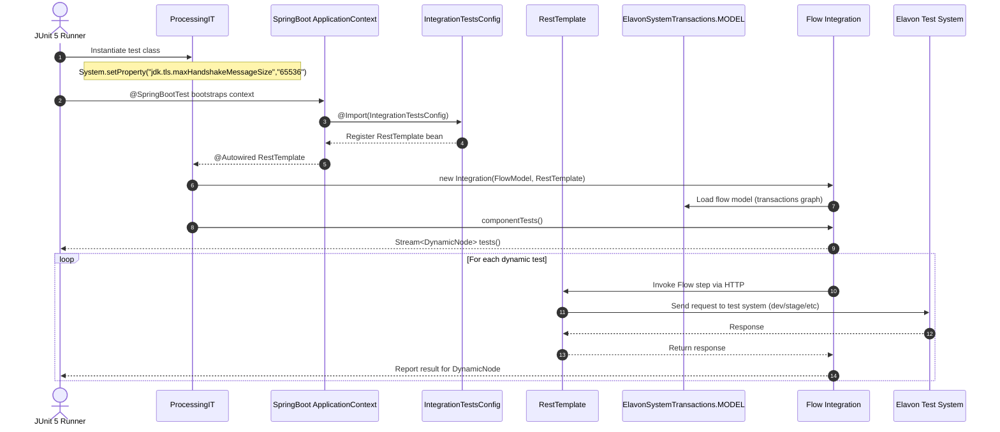

# ProcessingIT Flow & Configuration (Flow Framework Integration)

This diagram captures the configuration and runtime interactions of `ProcessingIT` with the Flow framework, highlighting Spring test wiring, TLS settings, model injection, and external calls.

- TLS: Sets `jdk.tls.maxHandshakeMessageSize=65536` to accommodate handshake size in tests.
- Spring Context: `@SpringBootTest` with `@Import(IntegrationTestsConfig)` supplies `RestTemplate`.
- Flow Model: `ElavonSystemTransactions.MODEL` defines transaction flows used by `Integration`.
- Execution: `Integration.tests()` produces `DynamicNode` stream executed by JUnit.
